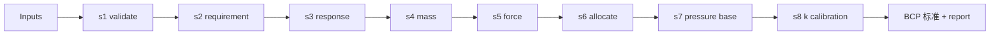

# README.md（brake-calc 仓库模板）

<aside>
📎

这是 `brake-calc` 仓库的 `README.md` 初稿，写给**人**看（同事、未来的你、集成方）。与 `AGENTS.md`（给 agent）和 `specs/brake-workflow.md`（业务真相）为姐妹文档。

</aside>

# brake-calc

> 城轨列车**制动压力标准**的确定性计算工具 —— 给定列车参数与制动需求，输出按 `load_group × brake_type × controller` 组织的压力标准矩阵，支持本地调试和 Hermes 云端部署。
> 

[python](https://img.shields.io/badge/python-3.11%2B-blue)

python

[tests](https://img.shields.io/badge/tests-pytest-green)

tests

[style](https://img.shields.io/badge/lint-ruff%20%2B%20mypy-informational)

style

## ♪ 能做什么

- 按**实验条件载荷**（AW0 / AW2 / AW3）× **制动类型**（FSB / EB / FB / 自定义比例制动）输出控制器级的 BCP 压力标准
- 支持**两种制动力分配策略**：等磨耗 / 等黏着（EB、FB 强制等黏着）
- 区分**动力车 / 非动力车**的转动惯量，按控制器聚合动态制动质量
- 双阶段的 **k(f) 标定**：调试前用默认常数，调试后用分段曲线（AW0/AW3 必需、AW2 可选 + fallback）
- 全程可追溯：Beta_list、Mass_by_controller、F_by_controller、BCP_base 等中间量及限幅/告警事件全部保留

## ♪ 快速上手

### 安装

```bash
git clone <repo-url> brake-calc
cd brake-calc
uv sync
```

### 跑示例

```bash
uv run python -m brake_calc run --config configs/example_input.yaml
```

预期输出（截取）：

```yaml
BCP_calibrated_by_controller:
  AW0:
    FSB: { C1: 312.4, C2: 298.1 }   # kPa
    EB:  { C1: 520.8, C2: 515.3 }
  AW2:
    FSB: { C1: 345.2, C2: 331.7 }
    EB:  { C1: 560.1, C2: 552.4 }
  AW3: ...
warnings: []
```

### 跑测试

```bash
uv run pytest                # 全部
uv run pytest tests/unit     # 单测
uv run pytest tests/integration  # 含 Mathcad 范例比对
```

## ♪ 使用示例——构造一份 Inputs

```yaml
# configs/example_input.yaml
v0: 80                 # km/h
requirement:
  FSB: { a_mean: 1.0 } # m/s^2
  EB:  { a_mean: 1.3 }
response_time:
  FSB: { t1: 0.4, t2: 0.8 }   # s
  EB:  { t1: 0.3, t2: 0.6 }
brake_types:
  - { name: FSB, source: kinematic }
  - { name: EB,  source: kinematic }
  - { name: FB,  source: copy_of_EB }
  - { name: holding, source: ratio_of_FSB, ratio: 0.5 }
allocation_strategy: equal_wear
vehicle_config:
  controllers:
    - { name: C1, car_type: powered }
    - { name: C2, car_type: trailer }
# … mass_params / mech_params / k_config / clamp_config …
```

完整字段定义见 [`specs/brake-workflow.md`](specs/brake-workflow.md) 第 4 章。

## ♪ 项目结构

```
src/brake_calc/
  contracts/   数据契约（pydantic）
  modules/     s1..s9 工作流模块
  domain/      纯计算函数
  workflow/    执行器 + workflow.yaml
  io/          配置加载 / 报表输出
configs/      示例和项目配置
tests/        单测 / 集成测试 / fixture
specs/        业务 spec（唯一真相）
```

## ♪ 架构一瞥



详细模块语义和数据契约见 spec 第 5、6 章。

## ♪ 文档索引

| 文档 | 用途 |
| --- | --- |
| [`specs/brake-workflow.md`](specs/brake-workflow.md) | 业务单一真相源（输入、模块、契约、workflow） |
| [`AGENTS.md`](https://AGENTS.md) | 仓库层面的 AI agent 工作规则 |
| [`docs/hermes-deployment.md`](docs/hermes-deployment.md) | Hermes 云端部署说明 |
| [`docs/calibration-guide.md`](docs/calibration-guide.md) | k(f) 标定曲线配置指南 |

## ♪ 开发

- Python 3.11+，包管理用 [uv](https://docs.astral.sh/uv/)
- 提交前必须通过：`uv run ruff check && uv run mypy src && uv run pytest`
- 贡献指南见 `AGENTS.md`（特别是使用 Codex / Claude Code 辅助开发时）

## ♪ License

<TBD>（MIT / Apache-2.0 / 私有）

## ♪ 联系

维护者：Dio · <[diowang13@126.com](mailto:diowang13@126.com)>