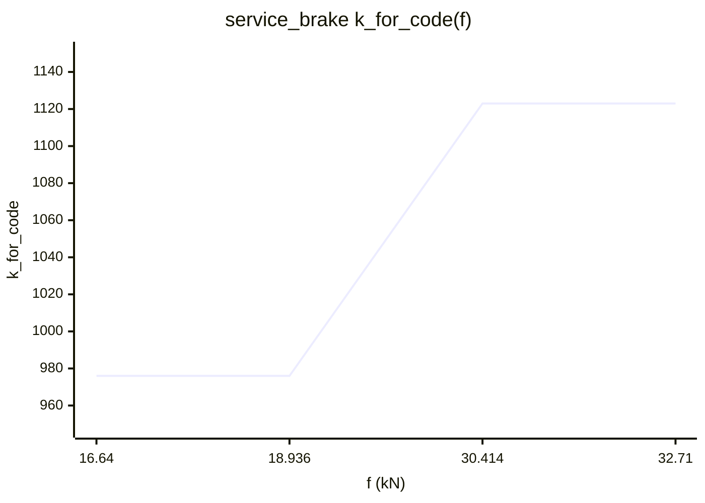
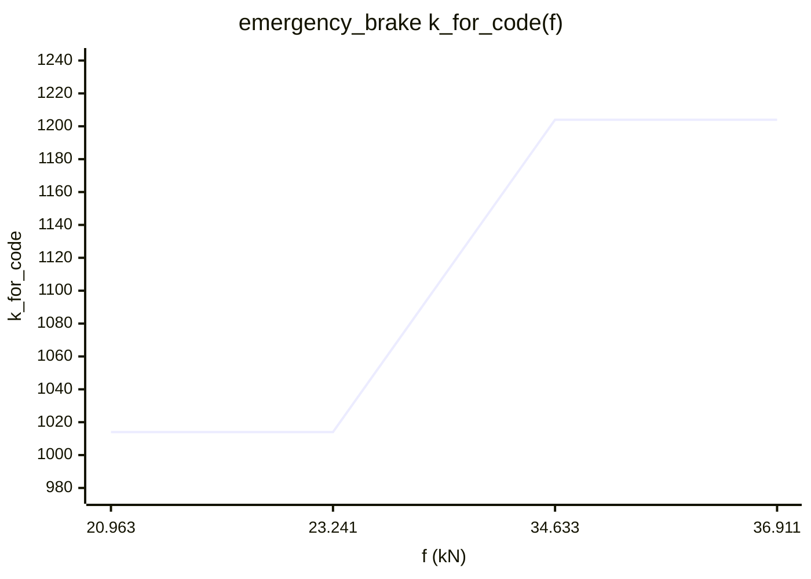

# Brake Calculation Report

## Summary

| brake_type | beta (m/s^2) |
| --- | ---: |
| FSB | 1.115 |
| EB | 1.335 |
| holding | 0.557 |
| jerk | 0.223 |

## Key Tables

### Pressure / Dynamic Load Matrix

Columns: `mass_dyn_t` = dynamic mass (ton), `spring_kPa` = air spring pressure (kPa), brake columns = BCP standard (kPa).

| case | mass_dyn_t | spring_kPa | EB | FSB | holding | jerk |
| --- | ---: | ---: | ---: | ---: | ---: | ---: |
| AW0 / trailer_bogie_1 | 16.14 | 250 | 243 | 210 | 117 | 62 |
| AW0 / trailer_bogie_2 | 16.14 | 250 | 243 | 210 | 117 | 62 |
| AW0 / powered_bogie_3 | 17.41 | 212 | 261 | 210 | 117 | 62 |
| AW0 / powered_bogie_4 | 17.41 | 212 | 261 | 210 | 117 | 62 |
| AW0 / powered_bogie_5 | 17.41 | 212 | 261 | 210 | 117 | 62 |
| AW0 / powered_bogie_6 | 17.41 | 212 | 261 | 210 | 117 | 62 |
| AW2 / trailer_bogie_1 | 23.04 | 401 | 375 | 317 | 157 | 78 |
| AW2 / trailer_bogie_2 | 23.04 | 401 | 375 | 317 | 157 | 78 |
| AW2 / powered_bogie_3 | 24.91 | 376 | 418 | 317 | 157 | 78 |
| AW2 / powered_bogie_4 | 24.91 | 376 | 418 | 317 | 157 | 78 |
| AW2 / powered_bogie_5 | 24.91 | 376 | 418 | 317 | 157 | 78 |
| AW2 / powered_bogie_6 | 24.91 | 376 | 418 | 317 | 157 | 78 |
| AW3 / trailer_bogie_1 | 25.95 | 465 | 442 | 367 | 173 | 84 |
| AW3 / trailer_bogie_2 | 25.95 | 465 | 442 | 367 | 173 | 84 |
| AW3 / powered_bogie_3 | 27.95 | 443 | 474 | 367 | 173 | 84 |
| AW3 / powered_bogie_4 | 27.95 | 443 | 474 | 367 | 173 | 84 |
| AW3 / powered_bogie_5 | 27.95 | 443 | 474 | 367 | 173 | 84 |
| AW3 / powered_bogie_6 | 27.95 | 443 | 474 | 367 | 173 | 84 |

## Checks

### Theoretical Speed Checks

| brake_type | speed_kmh | req_a_mean | distance_m | beta_used |
| --- | ---: | ---: | ---: | ---: |
| FSB | 40.0 | 0.907 | 68 | 1.115 |
| FSB | 60.0 | 0.967 | 144 | 1.115 |
| FSB | 80.0 | 1.000 | 247 | 1.115 |
| EB | 40.0 | 1.097 | 56 | 1.335 |
| EB | 60.0 | 1.167 | 119 | 1.335 |
| EB | 80.0 | 1.204 | 205 | 1.335 |

### Parking Brake Check

- `F_N_PB = parking brake normal force per brake unit (both sides, kN)`
- `F_PB = parking brake braking force per car (kN)`
- `F_PB = lever_ratio * F_N_PB * Np * xi0`
- `incline_force = resisting force per car on grade + wind (kN)`
- `safety_margin = F_PB / incline_force (-)`

| case | F_N_PB | F_PB | incline_force | safety_margin | whole_train_F_PB | whole_train_incline | pass |
| --- | ---: | ---: | ---: | ---: | ---: | ---: | --- |
| AW0 / car_1 | 22.095 | 30.932 | 13.753 | 2.249 | 92.797 | 43.261 | True |
| AW0 / car_2 | 22.095 | 30.932 | 14.754 | 2.097 | 92.797 | 43.261 | True |
| AW0 / car_3 | 22.095 | 30.932 | 14.754 | 2.097 | 92.797 | 43.261 | True |
| AW3 / car_1 | 22.095 | 30.932 | 18.907 | 1.636 | 92.797 | 59.473 | True |
| AW3 / car_2 | 22.095 | 30.932 | 20.283 | 1.525 | 92.797 | 59.473 | True |
| AW3 / car_3 | 22.095 | 30.932 | 20.283 | 1.525 | 92.797 | 59.473 | True |

### Electric Brake Summary

- enabled: False
- force_scope: train_total

## Controller Development Parameters

### Calibration Summary

#### service_brake

- point_pair_mode: `aw3_aw2`
- BCP0: 25 kPa
- BCP0_for_code = 25
- k_sb_for_code(f) = 12.807692 * f + 733.469035

| load_group | brake_type | k_for_code |
| --- | --- | ---: |
| AW2 | FSB | 1080 |
| AW3 | FSB | 1123 |

| point | force_kN | k_value | k_for_code |
| --- | ---: | ---: | ---: |
| input_AW2 | 27.074 | 10.800000 | 1080 |
| input_AW3 | 30.414 | 11.230000 | 1123 |
| curve_low | 18.936 | 9.752503 | 976 |
| curve_high | 30.414 | 11.230000 | 1123 |

k_sb(f) for controller code:
```text
976                       if f <= 18.936
12.807692 * f + 733.469035 if 18.936 < f < 30.414
1123                      if f >= 30.414
```


#### emergency_brake

- point_pair_mode: `aw3_aw0`
- BCP0: 25 kPa
- BCP0_for_code = 25
- k_eb_for_code(f) = 16.678285 * f + 626.387089

| load_group | brake_type | k_for_code |
| --- | --- | ---: |
| AW0 | EB | 1014 |
| AW3 | EB | 1204 |

| point | force_kN | k_value | k_for_code |
| --- | ---: | ---: | ---: |
| input_AW0 | 23.241 | 10.140000 | 1014 |
| input_AW3 | 34.633 | 12.040000 | 1204 |
| curve_low | 23.241 | 10.140000 | 1014 |
| curve_high | 34.633 | 12.040000 | 1204 |

k_eb(f) for controller code:
```text
1014                      if f <= 23.241
16.678285 * f + 626.387089 if 23.241 < f < 34.633
1204                      if f >= 34.633
```


### Dynamic Mass Formula

- `powered_bogie`: `mass_dynamic_ton = 0.0457770656901 * spring_pressure_kpa + 7.6939407187`
- `trailer_bogie`: `mass_dynamic_ton = 0.0457770656901 * spring_pressure_kpa + 4.6794407187`

### Pressure Conversion

| brake_type | case | k_used | k_code | BCP0 | BCP0_code |
| --- | --- | ---: | ---: | ---: | ---: |
| FSB | AW0 / trailer_bogie_1 | 9.752503 | 976 | 25 | 25 |
| FSB | AW0 / trailer_bogie_2 | 9.752503 | 976 | 25 | 25 |
| FSB | AW0 / powered_bogie_3 | 9.752503 | 976 | 25 | 25 |
| FSB | AW0 / powered_bogie_4 | 9.752503 | 976 | 25 | 25 |
| FSB | AW0 / powered_bogie_5 | 9.752503 | 976 | 25 | 25 |
| FSB | AW0 / powered_bogie_6 | 9.752503 | 976 | 25 | 25 |
| FSB | AW2 / trailer_bogie_1 | 10.800000 | 1080 | 25 | 25 |
| FSB | AW2 / trailer_bogie_2 | 10.800000 | 1080 | 25 | 25 |
| FSB | AW2 / powered_bogie_3 | 10.800000 | 1080 | 25 | 25 |
| FSB | AW2 / powered_bogie_4 | 10.800000 | 1080 | 25 | 25 |
| FSB | AW2 / powered_bogie_5 | 10.800000 | 1080 | 25 | 25 |
| FSB | AW2 / powered_bogie_6 | 10.800000 | 1080 | 25 | 25 |
| FSB | AW3 / trailer_bogie_1 | 11.230000 | 1123 | 25 | 25 |
| FSB | AW3 / trailer_bogie_2 | 11.230000 | 1123 | 25 | 25 |
| FSB | AW3 / powered_bogie_3 | 11.230000 | 1123 | 25 | 25 |
| FSB | AW3 / powered_bogie_4 | 11.230000 | 1123 | 25 | 25 |
| FSB | AW3 / powered_bogie_5 | 11.230000 | 1123 | 25 | 25 |
| FSB | AW3 / powered_bogie_6 | 11.230000 | 1123 | 25 | 25 |
| EB | AW0 / trailer_bogie_1 | 10.140000 | 1014 | 25 | 25 |
| EB | AW0 / trailer_bogie_2 | 10.140000 | 1014 | 25 | 25 |
| EB | AW0 / powered_bogie_3 | 10.140000 | 1014 | 25 | 25 |
| EB | AW0 / powered_bogie_4 | 10.140000 | 1014 | 25 | 25 |
| EB | AW0 / powered_bogie_5 | 10.140000 | 1014 | 25 | 25 |
| EB | AW0 / powered_bogie_6 | 10.140000 | 1014 | 25 | 25 |
| EB | AW2 / trailer_bogie_1 | 11.392235 | 1140 | 25 | 25 |
| EB | AW2 / trailer_bogie_2 | 11.392235 | 1140 | 25 | 25 |
| EB | AW2 / powered_bogie_3 | 11.809498 | 1181 | 25 | 25 |
| EB | AW2 / powered_bogie_4 | 11.809498 | 1181 | 25 | 25 |
| EB | AW2 / powered_bogie_5 | 11.809498 | 1181 | 25 | 25 |
| EB | AW2 / powered_bogie_6 | 11.809498 | 1181 | 25 | 25 |
| EB | AW3 / trailer_bogie_1 | 12.040000 | 1204 | 25 | 25 |
| EB | AW3 / trailer_bogie_2 | 12.040000 | 1204 | 25 | 25 |
| EB | AW3 / powered_bogie_3 | 12.040000 | 1204 | 25 | 25 |
| EB | AW3 / powered_bogie_4 | 12.040000 | 1204 | 25 | 25 |
| EB | AW3 / powered_bogie_5 | 12.040000 | 1204 | 25 | 25 |
| EB | AW3 / powered_bogie_6 | 12.040000 | 1204 | 25 | 25 |
| holding | AW0 / trailer_bogie_1 | 9.752503 | 976 | 25 | 25 |
| holding | AW0 / trailer_bogie_2 | 9.752503 | 976 | 25 | 25 |
| holding | AW0 / powered_bogie_3 | 9.752503 | 976 | 25 | 25 |
| holding | AW0 / powered_bogie_4 | 9.752503 | 976 | 25 | 25 |
| holding | AW0 / powered_bogie_5 | 9.752503 | 976 | 25 | 25 |
| holding | AW0 / powered_bogie_6 | 9.752503 | 976 | 25 | 25 |
| holding | AW2 / trailer_bogie_1 | 9.752503 | 976 | 25 | 25 |
| holding | AW2 / trailer_bogie_2 | 9.752503 | 976 | 25 | 25 |
| holding | AW2 / powered_bogie_3 | 9.752503 | 976 | 25 | 25 |
| holding | AW2 / powered_bogie_4 | 9.752503 | 976 | 25 | 25 |
| holding | AW2 / powered_bogie_5 | 9.752503 | 976 | 25 | 25 |
| holding | AW2 / powered_bogie_6 | 9.752503 | 976 | 25 | 25 |
| holding | AW3 / trailer_bogie_1 | 9.752503 | 976 | 25 | 25 |
| holding | AW3 / trailer_bogie_2 | 9.752503 | 976 | 25 | 25 |
| holding | AW3 / powered_bogie_3 | 9.752503 | 976 | 25 | 25 |
| holding | AW3 / powered_bogie_4 | 9.752503 | 976 | 25 | 25 |
| holding | AW3 / powered_bogie_5 | 9.752503 | 976 | 25 | 25 |
| holding | AW3 / powered_bogie_6 | 9.752503 | 976 | 25 | 25 |
| jerk | AW0 / trailer_bogie_1 | 9.752503 | 976 | 25 | 25 |
| jerk | AW0 / trailer_bogie_2 | 9.752503 | 976 | 25 | 25 |
| jerk | AW0 / powered_bogie_3 | 9.752503 | 976 | 25 | 25 |
| jerk | AW0 / powered_bogie_4 | 9.752503 | 976 | 25 | 25 |
| jerk | AW0 / powered_bogie_5 | 9.752503 | 976 | 25 | 25 |
| jerk | AW0 / powered_bogie_6 | 9.752503 | 976 | 25 | 25 |
| jerk | AW2 / trailer_bogie_1 | 9.752503 | 976 | 25 | 25 |
| jerk | AW2 / trailer_bogie_2 | 9.752503 | 976 | 25 | 25 |
| jerk | AW2 / powered_bogie_3 | 9.752503 | 976 | 25 | 25 |
| jerk | AW2 / powered_bogie_4 | 9.752503 | 976 | 25 | 25 |
| jerk | AW2 / powered_bogie_5 | 9.752503 | 976 | 25 | 25 |
| jerk | AW2 / powered_bogie_6 | 9.752503 | 976 | 25 | 25 |
| jerk | AW3 / trailer_bogie_1 | 9.752503 | 976 | 25 | 25 |
| jerk | AW3 / trailer_bogie_2 | 9.752503 | 976 | 25 | 25 |
| jerk | AW3 / powered_bogie_3 | 9.752503 | 976 | 25 | 25 |
| jerk | AW3 / powered_bogie_4 | 9.752503 | 976 | 25 | 25 |
| jerk | AW3 / powered_bogie_5 | 9.752503 | 976 | 25 | 25 |
| jerk | AW3 / powered_bogie_6 | 9.752503 | 976 | 25 | 25 |

### Force To Pressure Formula

| brake_type | case | force_kN | formula | formula_with_force |
| --- | --- | ---: | --- | --- |
| FSB | AW0 / trailer_bogie_1 | 18.936 | BCP_by_controller_kPa = 9.7525 * F_by_controller_kN + 25 | BCP_by_controller_kPa = 9.7525 * 18.9364 + 25 |
| FSB | AW0 / trailer_bogie_2 | 18.936 | BCP_by_controller_kPa = 9.7525 * F_by_controller_kN + 25 | BCP_by_controller_kPa = 9.7525 * 18.9364 + 25 |
| FSB | AW0 / powered_bogie_3 | 18.936 | BCP_by_controller_kPa = 9.7525 * F_by_controller_kN + 25 | BCP_by_controller_kPa = 9.7525 * 18.9364 + 25 |
| FSB | AW0 / powered_bogie_4 | 18.936 | BCP_by_controller_kPa = 9.7525 * F_by_controller_kN + 25 | BCP_by_controller_kPa = 9.7525 * 18.9364 + 25 |
| FSB | AW0 / powered_bogie_5 | 18.936 | BCP_by_controller_kPa = 9.7525 * F_by_controller_kN + 25 | BCP_by_controller_kPa = 9.7525 * 18.9364 + 25 |
| FSB | AW0 / powered_bogie_6 | 18.936 | BCP_by_controller_kPa = 9.7525 * F_by_controller_kN + 25 | BCP_by_controller_kPa = 9.7525 * 18.9364 + 25 |
| FSB | AW2 / trailer_bogie_1 | 27.074 | BCP_by_controller_kPa = 10.8 * F_by_controller_kN + 25 | BCP_by_controller_kPa = 10.8 * 27.0735 + 25 |
| FSB | AW2 / trailer_bogie_2 | 27.074 | BCP_by_controller_kPa = 10.8 * F_by_controller_kN + 25 | BCP_by_controller_kPa = 10.8 * 27.0735 + 25 |
| FSB | AW2 / powered_bogie_3 | 27.074 | BCP_by_controller_kPa = 10.8 * F_by_controller_kN + 25 | BCP_by_controller_kPa = 10.8 * 27.0735 + 25 |
| FSB | AW2 / powered_bogie_4 | 27.074 | BCP_by_controller_kPa = 10.8 * F_by_controller_kN + 25 | BCP_by_controller_kPa = 10.8 * 27.0735 + 25 |
| FSB | AW2 / powered_bogie_5 | 27.074 | BCP_by_controller_kPa = 10.8 * F_by_controller_kN + 25 | BCP_by_controller_kPa = 10.8 * 27.0735 + 25 |
| FSB | AW2 / powered_bogie_6 | 27.074 | BCP_by_controller_kPa = 10.8 * F_by_controller_kN + 25 | BCP_by_controller_kPa = 10.8 * 27.0735 + 25 |
| FSB | AW3 / trailer_bogie_1 | 30.414 | BCP_by_controller_kPa = 11.23 * F_by_controller_kN + 25 | BCP_by_controller_kPa = 11.23 * 30.4138 + 25 |
| FSB | AW3 / trailer_bogie_2 | 30.414 | BCP_by_controller_kPa = 11.23 * F_by_controller_kN + 25 | BCP_by_controller_kPa = 11.23 * 30.4138 + 25 |
| FSB | AW3 / powered_bogie_3 | 30.414 | BCP_by_controller_kPa = 11.23 * F_by_controller_kN + 25 | BCP_by_controller_kPa = 11.23 * 30.4138 + 25 |
| FSB | AW3 / powered_bogie_4 | 30.414 | BCP_by_controller_kPa = 11.23 * F_by_controller_kN + 25 | BCP_by_controller_kPa = 11.23 * 30.4138 + 25 |
| FSB | AW3 / powered_bogie_5 | 30.414 | BCP_by_controller_kPa = 11.23 * F_by_controller_kN + 25 | BCP_by_controller_kPa = 11.23 * 30.4138 + 25 |
| FSB | AW3 / powered_bogie_6 | 30.414 | BCP_by_controller_kPa = 11.23 * F_by_controller_kN + 25 | BCP_by_controller_kPa = 11.23 * 30.4138 + 25 |
| EB | AW0 / trailer_bogie_1 | 21.540 | BCP_by_controller_kPa = 10.14 * F_by_controller_kN + 25 | BCP_by_controller_kPa = 10.14 * 21.5395 + 25 |
| EB | AW0 / trailer_bogie_2 | 21.540 | BCP_by_controller_kPa = 10.14 * F_by_controller_kN + 25 | BCP_by_controller_kPa = 10.14 * 21.5395 + 25 |
| EB | AW0 / powered_bogie_3 | 23.241 | BCP_by_controller_kPa = 10.14 * F_by_controller_kN + 25 | BCP_by_controller_kPa = 10.14 * 23.2406 + 25 |
| EB | AW0 / powered_bogie_4 | 23.241 | BCP_by_controller_kPa = 10.14 * F_by_controller_kN + 25 | BCP_by_controller_kPa = 10.14 * 23.2406 + 25 |
| EB | AW0 / powered_bogie_5 | 23.241 | BCP_by_controller_kPa = 10.14 * F_by_controller_kN + 25 | BCP_by_controller_kPa = 10.14 * 23.2406 + 25 |
| EB | AW0 / powered_bogie_6 | 23.241 | BCP_by_controller_kPa = 10.14 * F_by_controller_kN + 25 | BCP_by_controller_kPa = 10.14 * 23.2406 + 25 |
| EB | AW2 / trailer_bogie_1 | 30.749 | BCP_by_controller_kPa = 11.3922 * F_by_controller_kN + 25 | BCP_by_controller_kPa = 11.3922 * 30.7487 + 25 |
| EB | AW2 / trailer_bogie_2 | 30.749 | BCP_by_controller_kPa = 11.3922 * F_by_controller_kN + 25 | BCP_by_controller_kPa = 11.3922 * 30.7487 + 25 |
| EB | AW2 / powered_bogie_3 | 33.251 | BCP_by_controller_kPa = 11.8095 * F_by_controller_kN + 25 | BCP_by_controller_kPa = 11.8095 * 33.2506 + 25 |
| EB | AW2 / powered_bogie_4 | 33.251 | BCP_by_controller_kPa = 11.8095 * F_by_controller_kN + 25 | BCP_by_controller_kPa = 11.8095 * 33.2506 + 25 |
| EB | AW2 / powered_bogie_5 | 33.251 | BCP_by_controller_kPa = 11.8095 * F_by_controller_kN + 25 | BCP_by_controller_kPa = 11.8095 * 33.2506 + 25 |
| EB | AW2 / powered_bogie_6 | 33.251 | BCP_by_controller_kPa = 11.8095 * F_by_controller_kN + 25 | BCP_by_controller_kPa = 11.8095 * 33.2506 + 25 |
| EB | AW3 / trailer_bogie_1 | 34.633 | BCP_by_controller_kPa = 12.04 * F_by_controller_kN + 25 | BCP_by_controller_kPa = 12.04 * 34.6326 + 25 |
| EB | AW3 / trailer_bogie_2 | 34.633 | BCP_by_controller_kPa = 12.04 * F_by_controller_kN + 25 | BCP_by_controller_kPa = 12.04 * 34.6326 + 25 |
| EB | AW3 / powered_bogie_3 | 37.308 | BCP_by_controller_kPa = 12.04 * F_by_controller_kN + 25 | BCP_by_controller_kPa = 12.04 * 37.308 + 25 |
| EB | AW3 / powered_bogie_4 | 37.308 | BCP_by_controller_kPa = 12.04 * F_by_controller_kN + 25 | BCP_by_controller_kPa = 12.04 * 37.308 + 25 |
| EB | AW3 / powered_bogie_5 | 37.308 | BCP_by_controller_kPa = 12.04 * F_by_controller_kN + 25 | BCP_by_controller_kPa = 12.04 * 37.308 + 25 |
| EB | AW3 / powered_bogie_6 | 37.308 | BCP_by_controller_kPa = 12.04 * F_by_controller_kN + 25 | BCP_by_controller_kPa = 12.04 * 37.308 + 25 |
| holding | AW0 / trailer_bogie_1 | 9.468 | BCP_by_controller_kPa = 9.7525 * F_by_controller_kN + 25 | BCP_by_controller_kPa = 9.7525 * 9.46818 + 25 |
| holding | AW0 / trailer_bogie_2 | 9.468 | BCP_by_controller_kPa = 9.7525 * F_by_controller_kN + 25 | BCP_by_controller_kPa = 9.7525 * 9.46818 + 25 |
| holding | AW0 / powered_bogie_3 | 9.468 | BCP_by_controller_kPa = 9.7525 * F_by_controller_kN + 25 | BCP_by_controller_kPa = 9.7525 * 9.46818 + 25 |
| holding | AW0 / powered_bogie_4 | 9.468 | BCP_by_controller_kPa = 9.7525 * F_by_controller_kN + 25 | BCP_by_controller_kPa = 9.7525 * 9.46818 + 25 |
| holding | AW0 / powered_bogie_5 | 9.468 | BCP_by_controller_kPa = 9.7525 * F_by_controller_kN + 25 | BCP_by_controller_kPa = 9.7525 * 9.46818 + 25 |
| holding | AW0 / powered_bogie_6 | 9.468 | BCP_by_controller_kPa = 9.7525 * F_by_controller_kN + 25 | BCP_by_controller_kPa = 9.7525 * 9.46818 + 25 |
| holding | AW2 / trailer_bogie_1 | 13.537 | BCP_by_controller_kPa = 9.7525 * F_by_controller_kN + 25 | BCP_by_controller_kPa = 9.7525 * 13.5368 + 25 |
| holding | AW2 / trailer_bogie_2 | 13.537 | BCP_by_controller_kPa = 9.7525 * F_by_controller_kN + 25 | BCP_by_controller_kPa = 9.7525 * 13.5368 + 25 |
| holding | AW2 / powered_bogie_3 | 13.537 | BCP_by_controller_kPa = 9.7525 * F_by_controller_kN + 25 | BCP_by_controller_kPa = 9.7525 * 13.5368 + 25 |
| holding | AW2 / powered_bogie_4 | 13.537 | BCP_by_controller_kPa = 9.7525 * F_by_controller_kN + 25 | BCP_by_controller_kPa = 9.7525 * 13.5368 + 25 |
| holding | AW2 / powered_bogie_5 | 13.537 | BCP_by_controller_kPa = 9.7525 * F_by_controller_kN + 25 | BCP_by_controller_kPa = 9.7525 * 13.5368 + 25 |
| holding | AW2 / powered_bogie_6 | 13.537 | BCP_by_controller_kPa = 9.7525 * F_by_controller_kN + 25 | BCP_by_controller_kPa = 9.7525 * 13.5368 + 25 |
| holding | AW3 / trailer_bogie_1 | 15.207 | BCP_by_controller_kPa = 9.7525 * F_by_controller_kN + 25 | BCP_by_controller_kPa = 9.7525 * 15.2069 + 25 |
| holding | AW3 / trailer_bogie_2 | 15.207 | BCP_by_controller_kPa = 9.7525 * F_by_controller_kN + 25 | BCP_by_controller_kPa = 9.7525 * 15.2069 + 25 |
| holding | AW3 / powered_bogie_3 | 15.207 | BCP_by_controller_kPa = 9.7525 * F_by_controller_kN + 25 | BCP_by_controller_kPa = 9.7525 * 15.2069 + 25 |
| holding | AW3 / powered_bogie_4 | 15.207 | BCP_by_controller_kPa = 9.7525 * F_by_controller_kN + 25 | BCP_by_controller_kPa = 9.7525 * 15.2069 + 25 |
| holding | AW3 / powered_bogie_5 | 15.207 | BCP_by_controller_kPa = 9.7525 * F_by_controller_kN + 25 | BCP_by_controller_kPa = 9.7525 * 15.2069 + 25 |
| holding | AW3 / powered_bogie_6 | 15.207 | BCP_by_controller_kPa = 9.7525 * F_by_controller_kN + 25 | BCP_by_controller_kPa = 9.7525 * 15.2069 + 25 |
| jerk | AW0 / trailer_bogie_1 | 3.787 | BCP_by_controller_kPa = 9.7525 * F_by_controller_kN + 25 | BCP_by_controller_kPa = 9.7525 * 3.78727 + 25 |
| jerk | AW0 / trailer_bogie_2 | 3.787 | BCP_by_controller_kPa = 9.7525 * F_by_controller_kN + 25 | BCP_by_controller_kPa = 9.7525 * 3.78727 + 25 |
| jerk | AW0 / powered_bogie_3 | 3.787 | BCP_by_controller_kPa = 9.7525 * F_by_controller_kN + 25 | BCP_by_controller_kPa = 9.7525 * 3.78727 + 25 |
| jerk | AW0 / powered_bogie_4 | 3.787 | BCP_by_controller_kPa = 9.7525 * F_by_controller_kN + 25 | BCP_by_controller_kPa = 9.7525 * 3.78727 + 25 |
| jerk | AW0 / powered_bogie_5 | 3.787 | BCP_by_controller_kPa = 9.7525 * F_by_controller_kN + 25 | BCP_by_controller_kPa = 9.7525 * 3.78727 + 25 |
| jerk | AW0 / powered_bogie_6 | 3.787 | BCP_by_controller_kPa = 9.7525 * F_by_controller_kN + 25 | BCP_by_controller_kPa = 9.7525 * 3.78727 + 25 |
| jerk | AW2 / trailer_bogie_1 | 5.415 | BCP_by_controller_kPa = 9.7525 * F_by_controller_kN + 25 | BCP_by_controller_kPa = 9.7525 * 5.4147 + 25 |
| jerk | AW2 / trailer_bogie_2 | 5.415 | BCP_by_controller_kPa = 9.7525 * F_by_controller_kN + 25 | BCP_by_controller_kPa = 9.7525 * 5.4147 + 25 |
| jerk | AW2 / powered_bogie_3 | 5.415 | BCP_by_controller_kPa = 9.7525 * F_by_controller_kN + 25 | BCP_by_controller_kPa = 9.7525 * 5.4147 + 25 |
| jerk | AW2 / powered_bogie_4 | 5.415 | BCP_by_controller_kPa = 9.7525 * F_by_controller_kN + 25 | BCP_by_controller_kPa = 9.7525 * 5.4147 + 25 |
| jerk | AW2 / powered_bogie_5 | 5.415 | BCP_by_controller_kPa = 9.7525 * F_by_controller_kN + 25 | BCP_by_controller_kPa = 9.7525 * 5.4147 + 25 |
| jerk | AW2 / powered_bogie_6 | 5.415 | BCP_by_controller_kPa = 9.7525 * F_by_controller_kN + 25 | BCP_by_controller_kPa = 9.7525 * 5.4147 + 25 |
| jerk | AW3 / trailer_bogie_1 | 6.083 | BCP_by_controller_kPa = 9.7525 * F_by_controller_kN + 25 | BCP_by_controller_kPa = 9.7525 * 6.08277 + 25 |
| jerk | AW3 / trailer_bogie_2 | 6.083 | BCP_by_controller_kPa = 9.7525 * F_by_controller_kN + 25 | BCP_by_controller_kPa = 9.7525 * 6.08277 + 25 |
| jerk | AW3 / powered_bogie_3 | 6.083 | BCP_by_controller_kPa = 9.7525 * F_by_controller_kN + 25 | BCP_by_controller_kPa = 9.7525 * 6.08277 + 25 |
| jerk | AW3 / powered_bogie_4 | 6.083 | BCP_by_controller_kPa = 9.7525 * F_by_controller_kN + 25 | BCP_by_controller_kPa = 9.7525 * 6.08277 + 25 |
| jerk | AW3 / powered_bogie_5 | 6.083 | BCP_by_controller_kPa = 9.7525 * F_by_controller_kN + 25 | BCP_by_controller_kPa = 9.7525 * 6.08277 + 25 |
| jerk | AW3 / powered_bogie_6 | 6.083 | BCP_by_controller_kPa = 9.7525 * F_by_controller_kN + 25 | BCP_by_controller_kPa = 9.7525 * 6.08277 + 25 |
