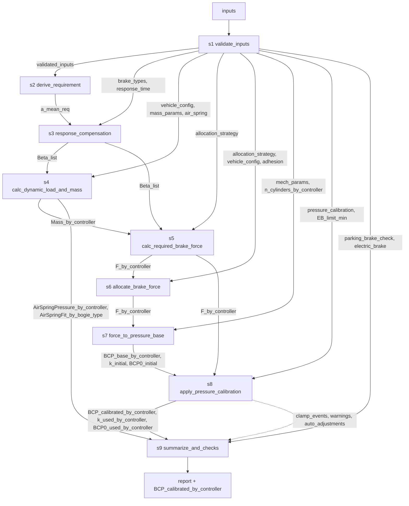

# 城轨制动计算 Workflow Spec（v1.0 草案）

<aside>
📌

这份文档是你这个“制动力计算 skill”的**确定性工作流 Spec**（面向 Codex 实现与 Hermes 调用）。

- 基础力-压力转换系数 `k_initial` 与初闸压力 `BCP0_initial` 不作为用户输入显式配置；由 `mech_params` 与 `n_cylinders_by_controller` 在 S7 内部推导
- 调试后：S8 可选按载荷组（AW0/AW3 必须，AW2 可选）、制动模式和 controller 目标制动力启用 `k(f)` 标定曲线，并按载荷组与制动模式选择固定 `BCP0`
</aside>

## 1. 输出位置与使用方式

- 本 spec 将作为项目的“唯一真相来源”（single source of truth）
- Codex：按本 spec 的模块接口与 workflow 顺序实现 Python 模块，并在本地进行项目调试。
- Hermes：后续部署到云端服务器，由Hermes按本 spec 的 inputs/配置加载并执行 workflow，输出压力标准与追溯信息。

## 2. 目标输出（Outputs）

### 2.1 主要输出

- `report`：最终结构化报告对象，包含压力标准、理论速度检查、控制器开发参数、校核结果、告警、自动调整记录、限幅事件与 trace
- `BCP_calibrated_by_controller` / `controller_pressure_standards`：每个控制器的目标控制压力/压力标准，单位 `kPa`
    - 输出按**实验条件载荷**（AW0 / AW2 / AW3）× **制动类型向量**（见 Inputs `brake_types`）组织，形成压力标准矩阵
    - 结构示意：`BCP_calibrated_by_controller[load_group][brake_type][controller] = pressure`
- Markdown 报告：CLI 可通过 `--markdown-output <path>` 导出 Markdown；PDF 暂不作为内置输出，由外部工具从 Markdown 转换
    - V1 Markdown 报告至少包含：
      - 顶层标题固定为：`Summary / Key Tables / Checks / Controller Development Parameters`
      - `Summary`：配置摘要与自动调整记录
      - `Key Tables`：`Pressure / Dynamic Load Matrix` 紧凑矩阵，同时展示动态载荷、空簧压力和各制动类型 BCP
      - `Checks`：理论速度检查、停放制动力校核结果、电制动摘要
      - `Controller Development Parameters`：`Calibration Summary`、动态载荷公式、压力转换参数、力到压力公式
      - `delta_BCP` 保留为结构化兼容字段，但不作为 Markdown 主视图展示


### 2.2 必须可追溯的中间量

- `Beta_list`：控制用目标减速度向量
    - 与 Inputs 中的 `brake_types` 一一对应，每个元素为该制动类型下的控制用目标减速度
    - 其中：
      - **紧急制动（EB）**的控制减速度由运动学方程（结合 `requirement` 与 `response_time.t1/t2`）计算得出
      - **最大常用制动（FSB）**的控制减速度由运动学方程（结合 `requirement` 与 `response_time.t1`、`response_time.impulse_rate` 联立求解）
      - **快速制动（FB）**不单独反求控制减速度，直接取 `Beta_FB = Beta_EB`
    - 其余用户自定义类型（如保持制动、跳跃制动）按其配置的 FSB 百分比直接缩放得到：`Beta[type] = ratio * Beta[FSB]`

- `Mass_by_controller`：按控制器聚合的静态质量 / 动态制动质量向量
    - 维度：`[load_group] × [controller]`
    - 架控时，动态质量的计算依赖该控制器对应转向架实例的 `bogie_type`（`powered_bogie` / `trailer_bogie`）
    - 车控时，动态质量的计算依赖该控制器对应车辆实例的 `car_type`（`powered_car` / `trailer_car`），并按一车两转向架聚合质量与转动惯量

- `F_by_controller`：每控制器目标制动力 f（kN）
- `k_initial`：S7 由机械模型推导的理论基础力-压力转换系数，单位 `kPa/kN`
- `BCP0_initial`：S7 由机械模型推导的理论初闸压力，单位 `kPa`
- `BCP_base_by_controller`：基础模型压力（未调试标定），按 `BCP_base = k_initial * F_by_controller + BCP0_initial` 计算
- `k_used_by_controller`：S8 最终实际使用的力-压力转换系数，单位 `kPa/kN`
- `BCP0_used_by_controller`：S8 最终实际使用的初闸压力，单位 `kPa`
- `AirSpringPressure_by_controller`
    - 维度：[load_group] × [controller]
    - 单位：kPa
- `AirSpringFit_by_bogie_type`
    - 维度：`[bogie_type]`
    - 内容：`{k, b, source_mode}`
    - 单位：`kPa/ton`、`kPa`
    - 含义：记录每类转向架采用的空簧线性公式，`source_mode` 取值为 `fitted_from_points` 或 `explicit_linear`
- `auto_adjustments`
    - 内容：自动采取的策略调整记录
    - 示例：等磨耗自动切换为等黏着、`FB` 压力超过 `EB` 后自动提高 `BCP0_EB`
- `CalibrationSummary`
    - 内容：标定试验点、生成的 `k_sb(f)` / `k_eb(f)`、最终生效的 `BCP0` / `BCP0_for_code`、输入标定点、最终曲线边界点、分段 `k_for_code` 公式，以及面向控制器开发的分段曲线图
- `ParkingBrakeCheckResult`
    - 内容：停放制动力校核结果
    - 包括：每车双侧作用力、每车停放制动力、每车倾斜力、每车安全余量、整列停放制动力、整列倾斜力、整列安全余量、是否通过
    - 字段语义：
      - `F_N_PB` = 单个制动单元闸片/瓦块双侧作用力（kN）
      - `F_PB` = 每车停放制动力（kN）
      - `whole_train` = 整列汇总停放制动力与倾斜力
    - S9 兼容保留 `parking_brake_check_result`，正式逐载荷组输出写入 `parking_brake_check_results_by_load_group`
- `ElectricBrakeSummary`
    - 内容：电制动特性输入摘要
    - 包括：是否启用、力值定义范围、识别出的特性点前若干项和末若干项

## 3. 关键工程规则（必须满足）

1. **载荷 AW0/AW2/AW3 仅用于选择参数组**，运行时不做组间插值
2. **标定曲线 `k(f)` 的自变量为单 controller 目标制动力 f**，即 `k = k_of_f(load_group, brake_mode, F_by_controller)`；不使用全列总力
3. **S7 机械模型参数与 S8 调试标定参数分离**：S7 推导 `k_initial` 与 `BCP0_initial`，S8 可选使用调试后的 `k(f)` 与 `BCP0` 计算最终压力
4. 校准不回写到 μ 或机械模型本体；只影响输出侧压力标准
5. 所有模式必须应用阀件限幅（如 EB 的 min/max）并在 report 中记录限幅触发

## 4. Inputs（输入参数，待你后续补齐单位/范围/默认值）

- `schema_version`：输入契约版本号。V1 固定为 `1`，用于后续配置迁移与兼容性控制。
- `v0`：最高速度（技术条件定义点）
- `V_list`：可选速度列表，单位 `km/h`，用于 S9 输出 `theoretical_speed_checks`。未配置时仅使用 `v0`；V1 对 `FSB`、`EB`、`FB` 生成理论速度检查，`ratio_of_FSB` 类型不单独生成。
- `requirement`：基础制动类型的技术条件输入
  - `FSB`：仅接受平均减速度要求 `a_mean`
  - `EB`：可接受平均减速度要求 `a_mean` 或制动距离要求 `distance`
  - `FB`：不单独配置 `requirement`，其控制目标减速度直接取 `EB`
  - `ratio_of_FSB` 类型不单独配置 `requirement`
  
- `brake_types`：制动类型向量，定义本次计算需要输出的所有制动类型
    - **必含项**：最大常用制动 `FSB`、紧急制动 `EB`
    - **可选项 1 — 快速制动 `FB`**
        - 行业内通常用 `Fast Brake` 指代快速制动
        - `FB` 的控制目标减速度直接等于 `EB` 的控制目标减速度，即 `Beta_FB = Beta_EB`
        - `FB` 的制动力分配策略强制为 `equal_adhesion`
        - `FB` 的响应模型使用常用制动形式（`t1 + impulse_rate`）
    - **可选项 2 — 用户自定义制动类型**
        - 一般以「最大常用制动 FSB 的百分比」形式定义
        - 例：保持制动 `holding = 50% FSB`
        - 例：跳跃制动 `jerk = 10% FSB`
    - 建议结构：
      ```yaml
      brake_types:
        - name: FSB
          source: kinematic
        - name: EB
          source: kinematic
        - name: FB
          source: fast_brake
        - name: holding
          source: ratio_of_FSB
          ratio: 0.5
      ```

        
- `response_time`：响应时间，按制动模式分别给出：
  - `FSB`
    - `t1`：空走时间（dead time）
    - `impulse_rate`：减速度上升率，单位 `m/s^3`
    - `t2` 不作为输入；由于其与控制减速度相互依赖，需在 `response_compensation` 中联立求解
  - `EB`
    - `t1`：空走时间（dead time）
    - `t2`：建立时间（build-up time），从开始产生减速度到减速度达到目标值 90% 的时间
  - `FB`
    - `t1`：空走时间（dead time）
    - `impulse_rate`：减速度上升率，单位 `m/s^3`
    - `FB` 不单独计算控制减速度，但需要在理论速度检查中使用该响应模型
  - `ratio_of_FSB` 类型不单独配置响应参数，直接沿用 FSB 的派生结果进行缩放

- 在 `response_compensation` 模块中：
  - `EB` 使用距离扣除模型，结合 `t1` 和 `t2` 由 `a_mean_req` 反推控制用目标减速度
  - `FSB` 使用距离扣除模型，结合 `t1` 和 `impulse_rate` 联立反求控制用目标减速度
  - `FB` 不单独反求控制目标减速度，直接取 `Beta_FB = Beta_EB`；但在 S9 理论速度检查中，仍使用 `FB` 自身的响应模型（`t1 + impulse_rate`）计算不同初速度下的理论制动距离与平均减速度


- `controller_type`：控制器粒度，取值为 `bogie` / `car`
  - 当 `controller_type = bogie` 时，一个 controller 对应一个转向架
  - 当 `controller_type = car` 时，一个 controller 对应一辆车
- `n_bogies_by_controller`：每个 controller 对应的 bogie 数量，关联 `controller_type`
  - `bogie` 时为 1
  - `car` 时为 2
- `n_springs_by_controller`：每个 controller 对应的空簧数量，关联 `controller_type`
  - `bogie` 时为 2
  - `car` 时为 4
- `n_cylinders_by_controller`：每个 controller 对应的制动缸数量，关联 `controller_type`
  - `bogie` 时为 4
  - `car` 时为 8

- `load_groups`：实验条件载荷组，取值为 AW0 / AW2 / AW3
- `air_spring`：支持空簧特征点和显式公式两种空簧特性输入。根据特征点拟合时不做分段线性，只收敛为单条直线 `pressure_kpa = k * sprung_mass_by_spring_ton + b`。运行时由 `sprung_mass = mass_static - bogie_weight` 得到控制器簧上质量，再按 `sprung_mass_by_spring_ton = sprung_mass / n_springs_by_controller` 计算单个空簧承担的簧上质量，并代入空簧公式。
  - fitted_from_points：输入若干 `[pressure_kpa, sprung_mass_by_spring_ton]`
  - explicit_linear：输入 airspring_k、airspring_b
- `mass_params`：转向架类型级质量参数，承载静态质量、转向架自重和旋转质量因子。`mass_static` 与 `bogie_weight` 均使用 `ton`，并在后续计算中保持 `ton`，不再换算为 `kg`。
  - 车控时，输入中的 `bogie_weight` 仍表示单个 bogie 自重；后台按一车两转向架聚合时乘 2
  - `powered_bogie` / `trailer_bogie` 的旋转质量参数（如 `rotational_mass_factor`）
  - 建议结构：
      ```yaml
        mass_params:
          powered_bogie:
            mass_static:
              AW0: ...
              AW2: ...
              AW3: ...
            bogie_weight: ...
            rotational_mass_factor: ...
          trailer_bogie:
            mass_static:
              AW0: ...
              AW2: ...
              AW3: ...
            bogie_weight: ...
            rotational_mass_factor: ...
        ```
  - 车控下 `powered_car` 对应两套 `powered_bogie` 参数，`trailer_car` 对应两套 `trailer_bogie` 参数

- `allocation_strategy`：制动力分配策略配置，可选一个：
    - `equal_wear`（等磨耗分配）：尽量在所有控制器上平均分配目标制动力
    - `equal_adhesion`（等黏着分配）：按各控制器控制范围内的载荷（`mass_dynamic`）比例分配
    - **适用规则**：
        - 紧急制动（EB）**必须**采用 `equal_adhesion`
        - 快速制动（FB）**必须**采用 `equal_adhesion`
        - 最大常用制动（FSB）及以 FSB 百分比定义的自定义类型按 `allocation_strategy` 配置执行
        - 若用户配置 `equal_wear` 但在当前载荷关系下超过全局黏着限制 `adhesion.mu_limit`，软件应自动切换为 `equal_adhesion`，并记录告警与自动调整信息

- `vehicle_config`：逐控制器实例配置，配置形态由 `controller_type` 决定
  - 当 `controller_type = bogie` 时，每个转向架实例对应一个控制器：
    - `name`
    - `bogie_type`：`powered_bogie` / `trailer_bogie`
    - 建议结构：
      ```yaml
      vehicle_config:
        bogies:
          - name: trailer_bogie_1
            bogie_type: trailer_bogie
          - name: powered_bogie_3
            bogie_type: powered_bogie
      ```
    - `trailer_bogie_1` 表示编号为 1 的拖车转向架实例
    - `powered_bogie_3` 表示编号为 3 的动力转向架实例
  - 当 `controller_type = car` 时，每辆车对应一个控制器：
    - `name`
    - `car_type`：`powered_car` / `trailer_car`
    - 建议结构：
      ```yaml
      vehicle_config:
        cars:
          - name: trailer_car_1
            car_type: trailer_car
          - name: powered_car_2
            car_type: powered_car
      ```
    - `powered_car` 表示该控制器控制一辆由两个动力转向架组成的车辆
    - `trailer_car` 表示该控制器控制一辆由两个拖车转向架组成的车辆
    - 若一辆车存在动架与拖架混合，则业务上不采用车控 BCU，而改用架控
- 静态质量不在实例层配置；实例的 `bogie_type` 或 `car_type` 用于到 `mass_params` 中读取对应类型参数

- `mass_static` = `sprung_mass` + `bogie_weight`
- `sprung_mass` = `mass_static` - `bogie_weight`    
- `mech_params`：制动缸机械模型参数，全列共享一套，用于在 S7 中由 `F_by_controller` 反算基础制动缸压力 `BCP_base_by_controller`，并内部推导基础力-压力转换系数 `k_initial`。V1 支持：
  - `cylinder_type: tread_cylinder`
  - `cylinder_type: caliper_cylinder`
  - 制动缸数量不在 `mech_params` 中重复配置，统一使用顶层 `n_cylinders_by_controller`
  - 通用字段建议结构：
    ```yaml
    mech_params:
      cylinder_type: tread_cylinder   # or caliper_cylinder
      Sc: 0.0248     # 单位: m^2，活塞有效面积
      xi: 0.29       # 单位: -，摩擦系数
      Li: 3.4        # 单位: -，单元内部倍率
      eta_i: 0.95    # 单位: -，单元内部效率
      Lo: 1.0        # 单位: -，外部倍率
      eta_o: 1.0     # 单位: -，外部效率
      Fs1: 1.0       # 单位: kN，单元复位力 1
      Fs2: 0.25      # 单位: kN，单元复位力 2
      Dw: ...        # 单位: m，仅 caliper_cylinder 需要
      Rf: ...        # 单位: m，仅 caliper_cylinder 需要
    ```
  - `Fw` 暂不作为 YAML 接口暴露，V1 按 `Fw = 0` 处理
  - 对 `tread_cylinder`，标准公式中的 `Dw / (2 * Rf)` 按 1 处理，因此网页端不需要输入 `Dw` 和 `Rf`
  - 对 `caliper_cylinder`，必须显式配置 `Dw` 和 `Rf`

- `pressure_calibration`：可选压力标定配置，用于 S8 输出侧标定。V1 采用**试验点驱动**方式输入，不要求用户直接维护完整 `k_segments`。标定分为两组：
  - `service_brake`：生成常用/快速制动共用的 `k_sb(f)` 与 `BCP0_sb`
  - `emergency_brake`：生成紧急制动独立的 `k_eb(f)` 与 `BCP0_eb`
  - 两组都支持两种点组合方式：
    - `aw3_aw0`
    - `aw3_aw2`
  - 试验点输入建议结构：
    ```yaml
    pressure_calibration:
      enabled: true
      service_brake:
        BCP0: 25.0
        point_pair_mode: aw3_aw0
        points:
          - load_group: AW0
            brake_type: FB
            k_for_code: 1050
          - load_group: AW3
            brake_type: FSB
            k_for_code: 1200
      emergency_brake:
        BCP0: 30.0
        point_pair_mode: aw3_aw0
        points:
          - load_group: AW0
            brake_type: EB
            k_for_code: 1100
          - load_group: AW3
            brake_type: EB
            k_for_code: 1250
    ```

- `parking_brake_check`：停放制动力校核输入，仅用于校核，不参与常用/紧急/快速制动压力标准计算。建议结构：
  ```yaml
  parking_brake_check:
    enabled: true
    required_safety_margin: 1.2
    static_friction_coefficient: 0.35
    n_parking_cylinders_by_car: 1
    cylinder:
      Fp: 8.75
      Fs1: 1.2
      Fs2: 0.15
      Lpi: 2.04
      eta_pi: 1.0
      Lo: 1.0
      eta_o: 1.0
    environment:
      wind_speed_max: 34.0
      wind_resistance_coefficient: 0.0037
      grade_by_load_group:
        AW0: 40
        AW3: 40
    ```
  - 当前输入字段 `static_friction_coefficient` 在停车业务口径中承担 `xi0`
  - 停放制动力中的 `Lpi`、`Lo` 分别表示停放缸内部倍率与执行机构外部倍率；二者按公式单独参与计算，不与夹钳半径换算项混用
  - 另有制动形式相关的几何换算项 `brake_geometry_factor`：
    - `tread_cylinder`：`brake_geometry_factor = 1`
    - `caliper_cylinder`：`brake_geometry_factor = 2 * Rf / Dw`
  - 停放制动力公式口径：
    - `F_N_PB = ([(Fp - Fs2) * Lpi * eta_pi] - Fs1) * Lo * eta_o`
    - `F_PB = brake_geometry_factor * F_N_PB * Np * xi0`
  - `incline_force` 当前按“坡道项 + 风阻项”口径计算
  - 校核结果按 `parking_brake_check.environment.grade_by_load_group` 逐载荷组输出

- `adhesion`：全局黏着限制输入，供黏着校核与自动分配策略切换使用。建议结构：
  ```yaml
  adhesion:
    mu_limit: 0.16
  ```

- `electric_brake`：电制动特性输入预留，当前 V1 不参与主制动计算，仅保存识别后的结构化特性点。建议结构：
  ```yaml
  electric_brake:
    enabled: false
    force_scope: train_total
    characteristic_points: []
  ```

- force_scope 允许取值：
  - train_total
  - per_car
  - per_bogie
  - per_axle

- EB_limit_min：紧急制动输出最小压力值

- 压力限制规则：
  - EB max = 600
  - EB min = EB_limit_min
  - FSB/ratio_of_FSB/FB max = 当前载荷组下 EB 压力
  - FSB/ratio_of_FSB min = 无
  - FB 的最终压力不得超过 EB；若标定后 FB > EB，需自动提高 BCP0_EB 并重新计算 EB 压力标准

## 5. 模块间数据契约（Context 模型）

> 本节只定义**数据契约**（字段/形状/单位/生产者-消费者），不规定传输实现（dict / pydantic / JSON / RPC 均可）。具体实现方式放到代码仓库的 `AGENTS.md`。
> 

### 5.1 Context 原则

- 所有模块采用 `context_in → context_out` 语义，**追加式写入**（append-only），不得修改或覆盖上游已写字段
- 每个字段 key 在全局范围内唯一；一旦产出，下游只读引用
- 未消费的上游字段应**透传**到下游，以保证端到端可追溯
- 所有数值字段必须带**单位**（见下表），工程量纲不一致时需在 `validate_inputs` 中统一化
- 若计算过程中发生自动策略调整，必须保留原始输入语义，并把“实际使用配置”以独立字段（如 `auto_adjustments`）追加写入 context，不得覆盖上游输入


### 5.2 Context 字段清单

| key | shape | dtype / unit | producer | consumers |
| --- | --- | --- | --- | --- |
| `validated_inputs` | 嵌套对象 | — | s1 | s2–s9 |
| `a_mean_req` | `[brake_type]`（仅 kinematic 类型） | m/s² | s2 | s3 |
| `Beta_list` | `[brake_type]` | m/s² | s3 | s4, s5, s9 |
| `Mass_by_controller` | `[load_group, controller]` → `{mass_static, mass_dynamic}` | ton | s4 | s5, s6, s9 |
| `F_by_controller` | `[brake_type, load_group, controller]` | kN | s5 (+ s6 规范化) | s7, s8, s9 |
| `k_initial` | 标量 | kPa/kN | s7 | s8, s9 |
| `BCP0_initial` | 标量 | kPa | s7 | s8, s9 |
| `BCP_base_by_controller` | `[brake_type, load_group, controller]` | kPa | s7 | s8 |
| `k_used_by_controller` | `[brake_type, load_group, controller]` | kPa/kN | s8 | s9 |
| `BCP0_used_by_controller` | `[brake_type, load_group, controller]` | kPa | s8 | s9 |
| `BCP_calibrated_by_controller` | `[load_group, brake_type, controller]` | kPa | s8 | s9（最终输出） |
| `clamp_events` | `List[{brake_type, load_group, controller, kind, value_before, value_after}]` | — | s8 | s9 |
| `warnings` | `List[{code, message, context}]` | — | 任意模块 | s9 |
| `auto_adjustments` | `List[{code, message, original, applied, context}]` | — | s6, s8 | s9 |
| `trace` | `List[{step_id, module, inputs_hash, outputs_keys, elapsed_ms}]` | — | runner | s9 |
| `AirSpringPressure_by_controller` | `[load_group, controller]` | kPa | s4 | s9 |
| `AirSpringFit_by_bogie_type` | `[bogie_type] -> {k, b, source_mode}` | kPa/ton, kPa | s4 | s9 |
| `brake_summary` | `[brake_type] -> {beta}` | m/s² | s9 | report |
| `load_summary` | `[load_group, controller] -> {mass_dynamic, spring_pressure}` | ton, kPa | s9 | report |
| `controller_pressure_standards` | `[load_group, brake_type, controller]` | kPa | s9 | report / Markdown |
| `theoretical_speed_checks` | `[brake_type, speed_kmh] -> {requirement_a_mean, theoretical_distance_m, beta_used}` | m/s², m | s9 | report / Markdown |
| `controller_code_params` | `{dynamic_mass_formula, pressure_conversion}` | mixed | s9 | report / Markdown |
| `calibration_summary` | `{service_brake, emergency_brake}`，每组包含 `{BCP0, BCP0_for_code, point_pair_mode, input_points, curve_points, linear_formula_for_code}` | mixed | s9 | report / Markdown |
| `parking_brake_check_result` | `{per_car, whole_train, pass}`（兼容字段，默认取首个已配置载荷组结果） | mixed | s9 | report / Markdown |
| `parking_brake_check_results_by_load_group` | `[load_group] -> {per_car, whole_train, pass}` | mixed | s9 | report / Markdown |
| `electric_brake_summary` | `{enabled, force_scope, preview_head, preview_tail}` | mixed | s9 | report / Markdown |


### 5.3 关键张量形状（约定）

```yaml
F_by_controller:
  shape: [brake_type, load_group, controller]
  dtype: float
  unit: kN
BCP_base_by_controller:
  shape: [brake_type, load_group, controller]
  dtype: float
  unit: kPa
BCP_calibrated_by_controller:
  shape: [load_group, brake_type, controller]   # 最终输出按 load_group 为主索引
  dtype: float
  unit: kPa
```
补充约定：
- `Mass_by_controller` 在架控下对应单 bogie，在车控下对应整车聚合质量
- `AirSpringPressure_by_controller` 在架控和车控下都表示**单个空簧压力标准**
- `theoretical_speed_checks` 在 V1 中覆盖 `FSB`、`EB`、`FB`


### 5.4 错误 / 告警 / 追溯通道

- `warnings`：非致命情形写入，如 k 超标定范围、AW2 使用 fallback、限幅触发、超黏着后强制改用等黏着、`FB` 压力超过 `EB` 后自动上调 `BCP0_EB` 等；每条含稳定的 `code` 便于机器判定
- `auto_adjustments`：记录软件自动采取的策略调整，需保留原始用户输入与最终实际使用配置之间的差异，例如：
  - `equal_wear -> equal_adhesion`
  - `BCP0_EB` 自动提高
- `clamp_events`：阀件限幅的事件流，记录限幅前/后值，供 `summarize_and_checks` 统计
- `trace`：由 runner（本地调试或 Hermes）写入，每个 step 的输入 hash / 输出 key / 耗时，用于复跑比对
- **致命错误**（例如输入校验失败）应直接抛异常中止 workflow，不走 `warnings`

### 5.5 数据流图



## 6. Modules（模块接口定义）

> 每个模块都遵循：输入 `context` → 输出 `context`（添加字段，不破坏既有字段）
> 

1) `validate_inputs`

- in: inputs
- out: validated_inputs
- 作用：对输入参数做结构/类型/单位校验与归一化，填默认值，产出后续模块可信赖的 `validated_inputs`；质量字段在输入、Context 和计算中统一使用 `ton`。V1 需覆盖 `controller_type = bogie | car`、`fast_brake`、`caliper_cylinder`、`parking_brake_check`、`adhesion`、`electric_brake` 以及新的试验点驱动标定结构。

2) `derive_requirement`

- in: validated_inputs
- out: a_mean_req
- 作用：将技术条件 `requirement`（平均减速度 **或** 制动距离）统一换算成 `a_mean_req` —— 即各“运动学类”制动类型（当前为 `FSB`、`EB`）对应的平均减速度需求值；若输入为制动距离，在此处由 `v0` 和距离反算出等效平均减速度。`FB` 不单独进入 `a_mean_req`，而是在 S3 中直接继承 `Beta_EB`

3) `response_compensation`

- in: validated_inputs（含 `brake_types`、`response_time`） + a_mean_req
- out: `Beta_list`（与 `brake_types` 顺序对应的控制用目标减速度向量）
- note:
    - 对 `source: kinematic` 的 `EB`：
      - 先由 `a_mean_req` 反算标准制动距离 `S = v^2 / (2 * a_mean_req)`
      - 再按距离扣除模型补偿响应损失：
        `Beta_EB = v^2 / (2 * (S - v * (t1_EB + t2_EB / 2)))`
    - 对 `source: kinematic` 的 `FSB`：
      - 先由 `a_mean_req` 反算标准制动距离 `S = v^2 / (2 * a_mean_req)`
      - 建立时间由冲击率决定，`t2_FSB = Beta_FSB / impulse_rate`
      - 与距离扣除模型联立求解控制减速度
    - 对 `source: fast_brake` 的 `FB`：
      - 不单独反求控制目标减速度
      - 直接取 `Beta_FB = Beta_EB`
      - 但后续在 S9 理论速度检查中，仍使用 `FB` 自身的响应模型（`t1 + impulse_rate`）
    - 若响应损失距离不小于标准制动距离，则该输入无物理可行解，应报错
    - 对 `source: ratio_of_FSB` 的用户自定义类型，直接按 `ratio * Beta[FSB]` 得到，不再单独做运动学补偿

4) `calc_dynamic_load_and_mass`

- in: validated_inputs（由 `bogie_type` 或 `car_type` 去 `mass_params` 中读取质量参数、`air_spring`、`bogie_weight`）
- out: `Mass_by_controller`、`AirSpringPressure_by_controller`、`AirSpringFit_by_bogie_type`
- note:
    - 架控时，一个 controller 对应一个 bogie
    - 车控时，一个 controller 对应一辆车，按两个同类型 bogie 聚合：
      - `powered_car` = 两个 `powered_bogie`
      - `trailer_car` = 两个 `trailer_bogie`
    - 车控下：
      - `mass_static` 为整车级质量
      - `bogie_weight` 聚合时乘 2
      - `mass_dynamic` 为整车级动态制动质量
      - `n_springs_by_controller = 4`
    - 空簧压力公式始终输出**单个空簧压力标准**
    - 先算 `sprung_mass = mass_static - bogie_weight`
    - 再按 `sprung_mass_by_spring_ton = sprung_mass / n_springs_by_controller` 计算单个空簧承担的簧上质量
    - 动态制动质量按 `mass_dynamic = mass_static[load_group] + mass_static[AW0] * rotational_mass_factor` 计算，即旋转质量增量以同类型 AW0 静态质量为基准


5) `calc_required_brake_force`

- in: `Beta_list` + `Mass_by_controller`
- out: `F_by_controller`（kN），按 `brake_type × load_group × controller` 组织
- note:
    - 各制动类型的总目标制动力均按 `F_kN = mass_dynamic_ton * Beta` 计算
    - `EB` 强制采用 `equal_adhesion`
    - `FB` 强制采用 `equal_adhesion`
    - `FSB` 及 `ratio_of_FSB` 类型：
        - 若 `allocation_strategy = equal_wear`，则各控制器平均分配
        - 若 `allocation_strategy = equal_adhesion`，则按各 controller 的 `mass_dynamic` 比例分配
    - 质量单位采用 `ton`，制动力单位采用 `kN`
    - 此处参与目标制动力计算与等黏着分配的质量均为 `mass_dynamic`


6) `allocate_brake_force`

- in: `F_by_controller` + allocation_strategy + vehicle_config + adhesion
- out: F_by_controller（确认粒度与分配后的结构；如步骤 5 已按策略给出最终值，此步负责验证、约束修正与粒度规范化）
- 作用：校验分配结果是否满足设计约束，并统一输出粒度。
- note:
    - 对 `EB` 与 `FB`，必须使用 `equal_adhesion`
    - 对 `FSB` 与 `ratio_of_FSB`：
      - 若用户配置 `equal_wear`，先按等磨耗分配
      - 若校验发现超过全局黏着限制 `adhesion.mu_limit`
      - 则自动切换为 `equal_adhesion`
      - 写入 `warnings` 与 `auto_adjustments`
    - 输出中应保留原始配置与实际使用策略的差异信息，供 S9 汇总


7) `force_to_pressure_base`

- in: `F_by_controller` + `n_cylinders_by_controller` + `mech_params`
- out: `k_initial` + `BCP0_initial` + `BCP_base_by_controller`
- 作用：按制动缸机械模型推导理论基础力-压力转换参数，并将每 controller 目标制动力 `F_by_controller`（kN）反算为未标定的基础制动缸压力 `BCP_base_by_controller`（kPa）。
- note:
    - `k_initial` 与 `BCP0_initial` 不作为输入显式配置，由 `mech_params` 与 `n_cylinders_by_controller` 内部推导
    - 支持两种基础制动形式：
      - `tread_cylinder`
      - `caliper_cylinder`
    - `Fw` 在 V1 中按 `0` 处理，不作为 YAML 输入
    - 对 `tread_cylinder`：
      - `Dw / (2 * Rf)` 按 1 处理
      - 网页端不需要输入 `Dw` 和 `Rf`
    - 对 `caliper_cylinder`：
      - 必须显式输入 `Dw` 和 `Rf`
      - 计算公式中保留 `Dw / (2 * Rf)` 项
    - 统一线性形式仍为：
      ```text
      BCP_base = k_initial * F_by_controller + BCP0_initial
      ```
    - 单位约定：
      - `F_by_controller`、`Fs1`、`Fs2` 使用 kN
      - `Sc` 使用 m²
      - 输出 `BCP_base` 为 kPa
    - `k_initial` 与 `BCP0_initial` 必须由当前 `mech_params` 与 `n_cylinders_by_controller` 实时计算，不设置、不读取、不校准为固定示例值


8) `apply_pressure_calibration`

- in: `F_by_controller` + `BCP_base_by_controller` + `k_initial` + `BCP0_initial` + `pressure_calibration` + `EB_limit_min`
- out: `k_used_by_controller` + `BCP0_used_by_controller` + `BCP_calibrated_by_controller`
- 作用：可选应用调试标定参数，决定最终用于每个 controller 的 `k_used` 与 `BCP0_used`，计算最终压力标准并执行阀件限幅。
- note:
    - 若未启用标定，`k_used = k_initial`，`BCP0_used = BCP0_initial`
    - 若启用标定：
      - 常用/快速制动 (`FSB`、`FB`、`ratio_of_FSB`) 使用 `service_brake` 试验点生成的 `k_sb(f)` 与 `BCP0_sb`
      - 紧急制动 (`EB`) 使用 `emergency_brake` 试验点生成的 `k_eb(f)` 与 `BCP0_eb`
    - 试验点生成规则：
      - AW0 取该工况下各 controller 制动力最大值作为力坐标
      - AW3 取该工况下各 controller 制动力最小值作为力坐标
      - AW2 取该工况下各 controller 制动力平均值作为力坐标
    - 支持两种点组合：
      - `aw3_aw0`
      - `aw3_aw2`
    - 对 `aw3_aw2`：
      - 常用/快速制动需要外推到 AW0 参考力点
      - 若项目启用 `FB`，则 AW0 参考力取 `AW0 + FB` 工况下各 controller force 的最大值
      - 若项目未启用 `FB`，则 AW0 参考力取 `AW0 + FSB` 工况下各 controller force 的最大值
      - 紧急制动的 AW0 参考力取 `AW0 + EB` 工况下各 controller force 的最大值
    - 生成的 `k_sb(f)` 与 `k_eb(f)` 必须是覆盖完整有效力区间的分段曲线：
      - 低力段常数
      - 中间段线性
      - 高力段常数
      - 不允许出现某个有效力值下无可用 k 的情况
    - 最终压力统一按：
      ```text
      BCP_calibrated = k_used * F_by_controller + BCP0_used
      ```
    - `FB` 的最终压力不得超过 `EB`
      - 若同一 `load_group × controller` 下出现 `BCP_FB > BCP_EB`
      - 则自动提高 `BCP0_EB`
      - 并重新计算 `EB` 的最终压力标准
      - 同时记录 warning 和 auto_adjustment
    - `BCP_calibrated_by_controller` 以 `[load_group × brake_type × controller]` 的三维结构输出

9) `summarize_and_checks`

- in: all
- out: `report`
- 作用：汇总正式报告数据，供本地调试、Hermes 返回和 Markdown 导出使用。
- report 内容包括：
  - `brake_summary`：各 `brake_type` 的 `beta`
  - `load_summary`：各 `load_group × controller` 的 `mass_dynamic` 与 `spring_pressure`
  - `controller_pressure_standards` / `BCP_calibrated_by_controller`：各 `load_group × brake_type × controller` 的 BC 压力标准
  - `theoretical_speed_checks`：按 `V_list` 或默认 `v0` 输出 `FSB`、`EB`、`FB` 的理论速度检查值
    - `FSB`：使用其自身响应模型
    - `EB`：使用其自身响应模型
    - `FB`：控制目标减速度取 `Beta_EB`，但理论速度检查时使用 `FB` 自身的响应模型（`t1 + impulse_rate`）
    - `ratio_of_FSB` 类型不单独生成理论速度检查
  - `controller_code_params`：控制器开发用动态载荷公式和压力转换圆整参数
  - `calibration_summary`：标定试验点、生成的 `k_sb(f)` / `k_eb(f)`、`BCP0_sb` / `BCP0_eb`、以及 AW0/AW2/AW3 对应的 `k_for_code`
    - 对 Markdown 主视图：
      - 必须展示最终生效的 `BCP0` 与 `BCP0_for_code`
      - 必须展示输入标定点 `input_AW0 / input_AW2 / input_AW3`（按实际配置出现）
      - 必须展示最终曲线边界点 `curve_low / curve_high`
      - 必须明确区分“输入标定点”和“最终曲线边界点”
      - 必须展示 `k_for_code` 的分段公式与分段曲线图
      - 曲线图应体现“低段常数 + 中段线性 + 高段常数”，纵坐标按实际数据范围自适应，不强制从 0 起画
      - 若发生 `FB > EB` 自动调整，`emergency_brake` 下展示的 `BCP0` / `BCP0_for_code` 必须反映最终生效值，而非原始输入值
  - `parking_brake_check_result`：停放制动力校核结果，包括：
    - 每车双侧停放作用力 `F_N_PB`
    - 每车停放制动力 `F_PB`
    - 每车倾斜力 `incline_force`
    - 每车防滚安全余量
    - 整列停放制动力
    - 整列倾斜力
    - 整列防滚安全余量
    - 是否通过
    - `incline_force` 当前采用“坡道项 + 风阻项”口径
  - `parking_brake_check_results_by_load_group`：按 `grade_by_load_group` 逐载荷组输出正式停车校核结果；`parking_brake_check_result` 保留为兼容字段
  - `electric_brake_summary`：电制动特性输入摘要，仅展示识别后的特性点前若干项和末若干项，当前不参与主制动计算
  - `auto_adjustments`：自动调整记录，包括但不限于：
    - 超黏着后由 `equal_wear` 自动切换为 `equal_adhesion`
    - `FB` 压力超过 `EB` 后自动上调 `BCP0_EB`
  - `delta_BCP`、`warnings`、`clamp_events`、`trace`
- 报告显示精度：
  - 距离与 kPa 四舍五入到整数
  - 载重 ton 四舍五入到小数点后 2 位
  - 减速度四舍五入到小数点后 3 位


## 7. pressure_calibration（试验点驱动的压力标定）

### 7.1 默认基础换算

- 默认基础换算中的 `k_initial` 与 `BCP0_initial` 不作为用户输入显式配置，由 S7 根据 `mech_params` 与 `n_cylinders_by_controller` 推导。
- S7 理论基础压力为：
  ```text
  BCP_base = k_initial * F_by_controller + BCP0_initial
  ```
- `pressure_calibration` 仅描述输出侧调试标定参数，不覆盖 S7 的机械模型本体；V1 中标定输入采用“试验点驱动”结构，而不是直接配置完整分段曲线

### 7.2 标定开关

- `pressure_calibration.enabled = false` 时，S8 不做调试标定：
  - `k_used = k_initial`
  - `BCP0_used = BCP0_initial`
  - `BCP_calibrated = k_used * F_by_controller + BCP0_used`
- `pressure_calibration.enabled = true` 时，S8 使用试验点驱动标定配置：
  - 常用/快速制动：由 `service_brake` 生成 `k_sb(f)` 与 `BCP0_sb`
  - 紧急制动：由 `emergency_brake` 生成 `k_eb(f)` 与 `BCP0_eb`
  - 最终压力统一按：
    ```text
    BCP_calibrated = k_used * F_by_controller + BCP0_used
    ```

### 7.3 标定参数的作用域

- `k_initial`、`BCP0_initial` 由 S7 机械模型推导，作为未调试状态的理论基础值
- 调试后的系数分为两套：
  - `k_sb(f)` / `BCP0_sb`：常用/快速制动体系
  - `k_eb(f)` / `BCP0_eb`：紧急制动体系
- `k_sb(f)` 与 `k_eb(f)` 表示实际使用的力-压力转换系数，单位均为 `kPa/kN`
- `BCP0_sb` 与 `BCP0_eb` 表示实际使用的初闸压力，单位均为 `kPa`
- 两套标定参数都为全列共享；每个 controller 使用自身 `F_by_controller` 查询同一套曲线
- `FSB`、`FB` 和 `ratio_of_FSB` 共用 `service_brake` 标定结果
- `EB` 独立使用 `emergency_brake` 标定结果

### 7.4 标定输入配置（V1）

V1 中，`pressure_calibration` 不再要求用户直接维护完整的 `k_segments`。  
用户输入的是**标定试验点**与固定 `BCP0`，由 S8 根据试验点自动生成分段 `k(f)` 曲线。

`pressure_calibration` 分为两组：

- `service_brake`
  - 生成常用/快速制动共用的 `k_sb(f)` 与 `BCP0_sb`
  - 适用于：
    - `FSB`
    - `FB`
    - `ratio_of_FSB`
- `emergency_brake`
  - 生成紧急制动独立的 `k_eb(f)` 与 `BCP0_eb`
  - 适用于：
    - `EB`

建议结构：

```yaml
pressure_calibration:
  enabled: true
  service_brake:
    BCP0: 25.0
    point_pair_mode: aw3_aw0
    points:
      - load_group: AW0
        brake_type: FB
        k_for_code: 1050
      - load_group: AW3
        brake_type: FSB
        k_for_code: 1200
  emergency_brake:
    BCP0: 30.0
    point_pair_mode: aw3_aw0
    points:
      - load_group: AW0
        brake_type: EB
        k_for_code: 1100
      - load_group: AW3
        brake_type: EB
        k_for_code: 1250
```
- 字段约束：
  - `enabled` = false 时，S8 不应用调试标定
  - `enabled` = true 时：
    - service_brake 和 emergency_brake 两组都必须配置
  - 每组必须恰好提供两个试验点
  - `point_pair_mode` 仅允许：
    - aw3_aw0
    - aw3_aw2
  - `service_brake.points[].brake_type` 允许：
    - FSB
    - FB
  - `emergency_brake.points[].brake_type` 固定为：
    - EB
  
### 7.5 标定曲线生成规则

#### 7.5.1 力坐标选取规则

- 每个标定试验点都要先映射到一个 controller force 坐标。
- 对给定 load_group + brake_type 工况，先计算该工况下所有 controller 的 F_by_controller，再按以下规则选取力坐标：
  - AW0：取各 controller force 的最大值
  - AW3：取各 controller force 的最小值
  - AW2：取各 controller force 的平均值

#### 7.5.2 支持的点组合

- V1 支持两种标定点组合：
  - aw3_aw0
  - aw3_aw2
  
#### 7.5.3 aw3_aw0 生成规则

- 当使用 aw3_aw0 时：
  - 由 AW0 点与 AW3 点形成主线性段
  - 在 AW0 力坐标以下，使用 AW0 点对应的常数 k
  - 在 AW0 与 AW3 力坐标之间，使用线性段
  - 在 AW3 力坐标以上，使用 AW3 点对应的常数 k
  - 因此最终生成的 k(f) 一定是：
    - 低力段常数
    - 中间线性
    - 高力段常数

#### 7.5.4 aw3_aw2 生成规则

- 当使用 aw3_aw2 时：
  - 先用 AW2 点与 AW3 点拟合主线性段
  - 但低力侧不能留空，因此必须外推到一个 AW0 参考力点
  - 外推得到 AW0 参考力点对应的 k 值后：
    - 在该参考力以下，使用外推点常数
    - 在参考力与 AW3 点之间，使用线性段
    - 在 AW3 点以上，使用 AW3 点常数
  - report / Markdown 必须同时展示：
    - 原始输入标定点 `input_AW2`、`input_AW3`
    - 外推后用于曲线边界的 `curve_low`
    - 高段边界点 `curve_high`
  - 文档中必须明确“输入标定点”与“最终曲线边界点”不是同一概念

#### 7.5.5 aw3_aw2 的 AW0 参考力规则

- 对 service_brake：
  - 若项目启用 FB，则 AW0 参考力取 AW0 + FB 工况下各 controller force 的最大值
  - 若项目未启用 FB，则 AW0 参考力取 AW0 + FSB 工况下各 controller force 的最大值
- 对 emergency_brake：
  - AW0 参考力取 AW0 + EB 工况下各 controller force 的最大值

#### 7.5.6 作用域规则

- k_sb(f) 与 BCP0_sb 的作用域为全列共享
- k_eb(f) 与 BCP0_eb 的作用域为全列共享
- 每个 controller 使用自身的 F_by_controller 查询同一套曲线
- FSB、FB 和 ratio_of_FSB 类型共用 service_brake 生成的曲线
- EB 使用 emergency_brake 生成的曲线

#### 7.5.7 k_for_code 说明

- YAML 中输入的 k_for_code 为控制器开发口径数值。
- 在物理计算中，实际使用系数换算为：
  k = `k_for_code` / 100
- S9 仍需输出各载荷工况下的 k_for_code 值，供控制器开发使用

#### 7.5.8 FB 与 EB 的干涉处理

- 快速制动 FB 使用常用制动体系的 k_sb(f) 与 BCP0_sb。
- 若标定后出现同一 load_group × controller 下：
  BCP_FB > BCP_EB
  则：
  - 必须自动提高 BCP0_EB
  - 并重新计算 EB 的最终压力标准
  - 同时写入 warning 与 auto_adjustment
  - `report.calibration_summary.emergency_brake.BCP0` 与 `BCP0_for_code` 必须写入最终提升后的生效值
  - 网页交互与报告中需明确提示：
    “快速制动压力超过紧急制动压力，已自动上调紧急制动初闸压力 BCP0_EB 并重新计算紧急制动压力标准。”

#### 7.5.9 覆盖性要求
- V1 生成的 k_sb(f) 与 k_eb(f) 必须覆盖完整有效力区间。
- 不允许出现某个有效 controller force 落在曲线空档中、无法取得有效 k 值的情况

## 8. Workflow（确定执行顺序）

> 每个 step 用一句 `desc` 说明作用，详细语义见第 6 节同名模块
> 

```yaml
workflow:
  - id: s1
    use: validate_inputs
    desc: 校验输入结构与单位，填默认值，产出可信赖的 validated_inputs
  - id: s2
    use: derive_requirement
    needs: [s1]
    desc: 统一换算 requirement（平均减速度或制动距离）为 a_mean_req（运动学类型的平均减速度需求）
  - id: s3
    use: response_compensation
    needs: [s2]
    desc: 根据 FSB 的 `t1 + impulse_rate` 与 EB 的 `t1 + t2` 反求稳态目标减速度，产出 Beta_list（含 FSB/EB 运动学解、比例类型缩放）
  - id: s4
    use: calc_dynamic_load_and_mass
    needs: [s3]
    desc: 按 AW0/AW2/AW3 和转向架类型计算 Mass_by_controller（静态+含旋转质量的动态制动质量）,同时产出空簧压力标准和空簧拟合公式供调试/报告使用
  - id: s5
    use: calc_required_brake_force
    needs: [s4]
    desc: 结合 Beta_list、Mass_by_controller 与分配策略（EB 强制等黏着、FSB/比例类型按配置）得出 F_by_controller
  - id: s6
    use: allocate_brake_force
    needs: [s5]
    desc: 验证分配结果是否满足约束，统一结构粒度；越限则写入 warnings
  - id: s7
    use: force_to_pressure_base
    needs: [s6]
    desc: 用踏面制动缸机械模型（mech_params + n_cylinders_by_controller）将 F_by_controller 反算为未校准的 BCP_base_by_controller
  - id: s8
    use: apply_pressure_calibration
    needs: [s7]
    desc: 可选应用压力标定；按 load_group + brake_mode + controller force 选取 k(f)，按 load_group + brake_mode 选取 BCP0，计算最终 BCP_calibrated_by_controller 并执行限幅
  - id: s9
    use: summarize_and_checks
    needs: [s8]
    desc: 汇总压力标准、理论速度检查、控制器开发参数、告警、clamp 事件与 trace，生成结构化 report；CLI 可选导出 Markdown
```

## 9. 与 Mathcad 范例对齐（待补）

- 把 example_brake_calc.pdf 中的字段表、公式、结果表逐条映射到上述 modules 的输入/输出
