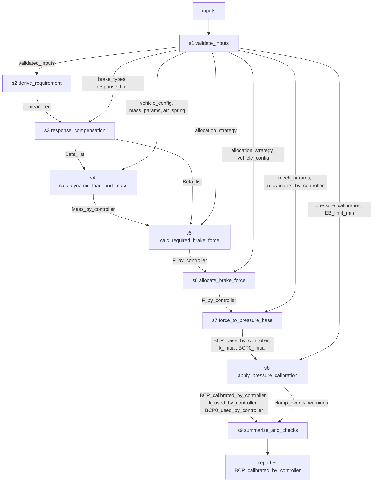

# 城轨制动计算 Workflow Spec（v1.0 草案）

<aside>
📌

这份文档是你这个“制动力计算 skill”的**确定性工作流 Spec**（面向 Codex 实现与 Hermes 调用）。

- 基础力-压力转换系数 `k_initial` 与初闸压力 `BCP0_initial` 不作为用户输入显式配置；由 `mech_params` 与 `n_cylinders_by_controller` 在 S7 内部推导
- 调试后：S8 可选按载荷组（AW0/AW3 必须，AW2 可选）、制动模式和 controller 目标制动力启用 `k(f)` 标定曲线，并按载荷组与制动模式选择固定 `BCP0`
</aside>

## 1. 输出位置与使用方式

- 本 spec 将作为项目的“唯一真相来源”（single source of truth）
- Codex：按本 spec 的模块接口与 workflow 顺序实现 Python 模块，并在本地进行项目调试。
- Hermes：后续部署到云端服务器，由Hermes按本 spec 的 inputs/配置加载并执行 workflow，输出压力标准与追溯信息。

## 2. 目标输出（Outputs）

### 2.1 主要输出

- `report`：最终结构化报告对象，包含压力标准、理论速度检查、控制器开发参数、告警、限幅事件与 trace。
- `BCP_calibrated_by_controller` / `controller_pressure_standards`：每个控制器的目标控制压力/压力标准，单位 `kPa`
    - 输出按**实验条件载荷**（AW0 / AW2 / AW3）× **制动类型向量**（见 Inputs `brake_types`）组织，形成压力标准矩阵
    - 结构示意：`BCP_calibrated_by_controller[load_group][brake_type][controller] = pressure`
- Markdown 报告：CLI 可通过 `--markdown-output <path>` 导出 Markdown；PDF 暂不作为内置输出，由外部工具从 Markdown 转换。

### 2.2 必须可追溯的中间量

- `Beta_list`：控制用目标减速度向量
    - 与 Inputs 中的 `brake_types` 一一对应，每个元素为该制动类型下的控制用目标减速度
    - 其中：
      - **紧急制动（EB）**的控制减速度由运动学方程（结合 `requirement` 与 `response_time.t1/t2`）计算得出;
      - **最大常用制动（FSB）**的控制减速度由运动学方程（结合 `requirement` 与 `response_time.t1`、`response_time.impulse_rate`联立求解）
    - 其余用户自定义类型（如保持制动、跳跃制动）按其配置的 FSB 百分比直接缩放得到：`Beta[type] = ratio * Beta[FSB]`
- `Mass_by_controller`：按控制器聚合的静态质量 / 动态制动质量向量
    - 维度：`[load_group] × [controller]`
    - 动态质量的计算依赖该控制器对应转向架实例的 `bogie_type`（`powered_bogie` / `trailer_bogie`），两者转动惯量不同
- `F_by_controller`：每控制器目标制动力 f（kN）
- `k_initial`：S7 由机械模型推导的理论基础力-压力转换系数，单位 `kPa/kN`
- `BCP0_initial`：S7 由机械模型推导的理论初闸压力，单位 `kPa`
- `BCP_base_by_controller`：基础模型压力（未调试标定），按 `BCP_base = k_initial * F_by_controller + BCP0_initial` 计算
- `k_used_by_controller`：S8 最终实际使用的力-压力转换系数，单位 `kPa/kN`
- `BCP0_used_by_controller`：S8 最终实际使用的初闸压力，单位 `kPa`
- `AirSpringPressure_by_controller`
    - 维度：[load_group] × [controller]
    - 单位：kPa
- `AirSpringFit_by_bogie_type`
    - 维度：`[bogie_type]`
    - 内容：`{k, b, source_mode}`
    - 单位：`kPa/ton`、`kPa`
    - 含义：记录每类转向架采用的空簧线性公式，`source_mode` 取值为 `fitted_from_points` 或 `explicit_linear`

## 3. 关键工程规则（必须满足）

1. **载荷 AW0/AW2/AW3 仅用于选择参数组**，运行时不做组间插值
2. **标定曲线 `k(f)` 的自变量为单 controller 目标制动力 f**，即 `k = k_of_f(load_group, brake_mode, F_by_controller)`；不使用全列总力
3. **S7 机械模型参数与 S8 调试标定参数分离**：S7 推导 `k_initial` 与 `BCP0_initial`，S8 可选使用调试后的 `k(f)` 与 `BCP0` 计算最终压力
4. 校准不回写到 μ 或机械模型本体；只影响输出侧压力标准
5. 所有模式必须应用阀件限幅（如 EB 的 min/max）并在 report 中记录限幅触发

## 4. Inputs（输入参数，待你后续补齐单位/范围/默认值）

- `v0`：最高速度（技术条件定义点）
- `V_list`：可选速度列表，单位 `km/h`，用于 S9 输出 `theoretical_speed_checks`。未配置时仅使用 `v0`；当前只对 FSB/EB 生成理论速度检查，`ratio_of_FSB` 类型不单独生成。
- `requirement`：基础制动类型的技术条件输入
  - `FSB`：仅接受平均减速度要求 `a_mean`
  - `EB`：可接受平均减速度要求 `a_mean` 或制动距离要求 `distance`
  - `ratio_of_FSB` 类型不单独配置 `requirement`
- `brake_types`：制动类型向量，定义本次计算需要输出的所有制动类型
    - **必含项**：最大常用制动 `FSB`、紧急制动 `EB`（二者的控制减速度由运动学方程计算）
    - **可选项 — 用户自定义制动类型**，一般以「最大常用制动 FSB 的百分比」形式定义
        - 例：保持制动 `holding = 50% FSB`
        - 例：跳跃制动 `jerk = 10% FSB`
    - 建议结构：
        
        ```yaml
        brake_types:
          - name: FSB
            source: kinematic     # 由运动学计算
          - name: EB
            source: kinematic
          - name: holding
            source: ratio_of_FSB
            ratio: 0.5
          - name: jerk
            source: ratio_of_FSB
            ratio: 0.1
        ```
        
- `response_time`：响应时间，按制动模式（常用/紧急/快速等）分别给出：
  - `FSB`
    - `t1`：空走时间（dead time）
    - `impulse_rate`：减速度上升率，单位 `m/s^3`
    - `t2` 不作为输入；由于其与控制减速度相互依赖，需在 `response_compensation` 中联立求解
  - `EB`
    - `t1`：空走时间（dead time）
    - `t2`：建立时间（build-up time），从开始产生减速度到减速度达到目标值 90% 的时间
  - `ratio_of_FSB` 类型不单独配置响应参数，直接沿用 FSB 的派生结果进行缩放
- 在 `response_compensation` 模块中：
  - `EB` 使用距离扣除模型，结合 `t1` 和 `t2` 由 `a_mean_req` 反推控制用目标减速度
  - `FSB` 使用距离扣除模型，结合 `t1` 和 `impulse_rate` 联立反求控制用目标减速度

- `controller_type`：控制器粒度，取值为 `bogie` / `car`。MVP 阶段固定为 `bogie`，即一个 controller 对应一个转向架；未来支持 `car` 时，一个 controller 对应一辆车。
- `n_bogies_by_controller` ：每个controller对应的bogie数量，关联 `controller_type`。当 `controller_type = bogie` 时为 1；当 `controller_type = car` 时为 2。MVP 阶段固定为 1。
- `n_springs_by_controller`：每个 controller 对应的空簧数量，关联 `controller_type`。当 `controller_type = bogie` 时为 2；当 `controller_type = car` 时为 4。MVP 阶段固定为 2。
- `n_cylinders_by_controller`：每个 controller 对应的制动缸数量，关联 `controller_type`。当 `controller_type = bogie` 时为 4；当 `controller_type = car` 时为 8。MVP 阶段固定为 4。
- `load_groups`：实验条件载荷组，取值为 AW0 / AW2 / AW3
- `air_spring`：支持空簧特征点和显式公式两种空簧特性输入。根据特征点拟合时不做分段线性，只收敛为单条直线 `pressure_kpa = k * sprung_mass_by_spring_ton + b`。运行时由 `sprung_mass = mass_static - bogie_weight` 得到控制器簧上质量，再按 `sprung_mass_by_spring_ton = sprung_mass / n_springs_by_controller` 计算单个空簧承担的簧上质量，并代入空簧公式。
  - fitted_from_points：输入若干 `[pressure_kpa, sprung_mass_by_spring_ton]`
  - explicit_linear：输入 airspring_k、airspring_b
- `mass_params`：转向架类型级质量参数，承载静态质量、转向架自重和旋转质量因子。`mass_static` 与 `bogie_weight` 均使用 `ton`，并在后续计算中保持 `ton`，不再换算为 `kg`。
  - `powered_bogie` / `trailer_bogie` 的旋转质量参数（如 `rotational_mass_factor`）
  - 建议结构：
      ```yaml
        mass_params:
          powered_bogie:
            mass_static:
              AW0: ...
              AW2: ...
              AW3: ...
            bogie_weight: ...
            rotational_mass_factor: ...
          trailer_bogie:
            mass_static:
              AW0: ...
              AW2: ...
              AW3: ...
            bogie_weight: ...
            rotational_mass_factor: ...

- `allocation_strategy`：制动力分配策略配置，可选一个：
    - `equal_wear`（等磨耗分配）：尽量在所有控制器上平均分配目标制动力
    - `equal_adhesion`（等黏着分配）：按各控制器控制范围内的载荷（`mass_dynamic`）比例分配
    - **适用规则**：
        - 紧急制动（EB）**必须**采用 `equal_adhesion`，不受本配置影响
        - 最大常用制动（FSB）及以 FSB 百分比定义的自定义类型（保持、跳跃等）按 `allocation_strategy` 配置执行
- `vehicle_config`：逐控制器实例配置。MVP 阶段 `controller_type = bogie`，因此配置形态为逐转向架实例配置
    - 当 `controller_type = bogie` 时，每个转向架实例对应一个控制器
    - 每个转向架实例需显式给出：
        - `name`
        - `bogie_type`：`powered_bogie` / `trailer_bogie`
    - 静态质量不在实例层配置；实例的 `bogie_type` 用于到 `mass_params` 中读取该类型的 `mass_static`、`bogie_weight` 和 `rotational_mass_factor`
    - `bogie_type` 用于选择该类转向架的共性参数，例如旋转质量因子
    - 建议结构：
        ```yaml
          vehicle_config:
            bogies:
              - name: trailer_bogie_1
                bogie_type: trailer_bogie
              - name: powered_bogie_3
                bogie_type: powered_bogie
        ```
    - trailer_bogie_1 表示编号为 1 的拖车转向架实例
      powered_bogie_3 表示编号为 3 的动力转向架实例
- `mass_static` = `sprung_mass` + `bogie_weight`
- `sprung_mass` = `mass_static` - `bogie_weight`    
- `mech_params`：制动缸机械模型参数，全列共享一套，用于在 S7 中由 `F_by_controller` 反算基础制动缸压力 `BCP_base_by_controller`，并内部推导基础力-压力转换系数 `k_initial`。MVP 阶段仅支持 `cylinder_type: tread_cylinder`（踏面制动缸），不支持 `caliper_cylinder`；`caliper_cylinder` 后续扩展。制动缸数量不在 `mech_params` 中重复配置，统一使用顶层 `n_cylinders_by_controller`。
  - MVP tread_cylinder 配置字段：
    ```yaml
    mech_params:
      cylinder_type: tread_cylinder
      Sc: 0.0248     # 单位: m^2，活塞有效面积
      xi: 0.29       # 单位: -，动摩擦系数
      Li: 3.4        # 单位: -，单元内部倍率
      eta_i: 0.95    # 单位: -，单元内部效率
      Lo: 1.0        # 单位: -，外部倍率
      eta_o: 1.0     # 单位: -，外部效率
      Fs1: 1.0       # 单位: kN，单元复位力 1
      Fs2: 0.25      # 单位: kN，单元复位力 2
    ```
  - `Fw` 暂不作为 YAML 接口暴露，MVP 按 `Fw = 0` 处理。
  - 对 `tread_cylinder`，踏面摩擦半径等效为车轮滚动半径，标准公式中的 `Dw / (2 * Rf)` 按 1 处理；因此 MVP 不配置 `Dw` 和 `Rf`。

- `pressure_calibration`：可选压力标定配置，用于 S8 输出侧标定；包含 `enabled`、按载荷组与制动模式组织的 `k(f)` 曲线、固定 `BCP0` 标定值以及 fallback 规则。不包含 S7 的基础机械模型默认参数。
- `EB_limit_min`：紧急制动输出最小压力值
- 压力限制规则：
    - `EB max = 600`
    - `EB min = EB_limit_min`
    - `FSB max = 当前载荷组下 EB 压力`
    - `FSB min = 无`


## 5. 模块间数据契约（Context 模型）

> 本节只定义**数据契约**（字段/形状/单位/生产者-消费者），不规定传输实现（dict / pydantic / JSON / RPC 均可）。具体实现方式放到代码仓库的 `AGENTS.md`。
> 

### 5.1 Context 原则

- 所有模块采用 `context_in → context_out` 语义，**追加式写入**（append-only），不得修改或覆盖上游已写字段
- 每个字段 key 在全局范围内唯一；一旦产出，下游只读引用
- 未消费的上游字段应**透传**到下游，以保证端到端可追溯
- 所有数值字段必须带**单位**（见下表），工程量纲不一致时需在 `validate_inputs` 中统一化

### 5.2 Context 字段清单

| key | shape | dtype / unit | producer | consumers |
| --- | --- | --- | --- | --- |
| `validated_inputs` | 嵌套对象 | — | s1 | s2–s9 |
| `a_mean_req` | `[brake_type]`（仅 kinematic 类型） | m/s² | s2 | s3 |
| `Beta_list` | `[brake_type]` | m/s² | s3 | s4, s5 |
| `Mass_by_controller` | `[load_group, controller]` → `{mass_static, mass_dynamic}` | ton | s4 | s5, s6 |
| `F_by_controller` | `[brake_type, load_group, controller]` | kN | s5 (+ s6 规范化) | s7, s8 |
| `k_initial` | 标量 | kPa/kN | s7 | s8, s9 |
| `BCP0_initial` | 标量 | kPa | s7 | s8, s9 |
| `BCP_base_by_controller` | `[brake_type, load_group, controller]` | kPa | s7 | s8 |
| `k_used_by_controller` | `[brake_type, load_group, controller]` | kPa/kN | s8 | s9 |
| `BCP0_used_by_controller` | `[brake_type, load_group, controller]` | kPa | s8 | s9 |
| `BCP_calibrated_by_controller` | `[load_group, brake_type, controller]` | kPa | s8 | s9（最终输出） |
| `clamp_events` | `List[{brake_type, load_group, controller, kind, value_before, value_after}]` | — | s8 | s9 |
| `warnings` | `List[{code, message, context}]` | — | 任意模块 | s9 |
| `trace` | `List[{step_id, module, inputs_hash, outputs_keys, elapsed_ms}]` | — | runner | s9 |
| `AirSpringPressure_by_controller` | `[load_group, controller]` | kPa | s4 | s9 |
| `AirSpringFit_by_bogie_type` | `[bogie_type]` -> `{k, b, source_mode}` | kPa/ton, kPa | s4 | s9 |
| `brake_summary` | `[brake_type] -> {beta}` | m/s² | s9 | report |
| `load_summary` | `[load_group, controller] -> {mass_dynamic, spring_pressure}` | ton, kPa | s9 | report |
| `controller_pressure_standards` | `[load_group, brake_type, controller]` | kPa | s9 | report / Markdown |
| `theoretical_speed_checks` | `[brake_type, speed_kmh] -> {requirement_a_mean, theoretical_distance_m, beta_used}` | m/s², m | s9 | report / Markdown |
| `controller_code_params` | `{dynamic_mass_formula, pressure_conversion}` | mixed | s9 | report / Markdown |

### 5.3 关键张量形状（约定）

```yaml
F_by_controller:
  shape: [brake_type, load_group, controller]
  dtype: float
  unit: kN
BCP_base_by_controller:
  shape: [brake_type, load_group, controller]
  dtype: float
  unit: kPa
BCP_calibrated_by_controller:
  shape: [load_group, brake_type, controller]   # 最终输出按 load_group 为主索引
  dtype: float
  unit: kPa
```

### 5.4 错误 / 告警 / 追溯通道

- `warnings`：非致命情形写入，如 k 超标定范围、AW2 使用 fallback、限幅触发等；每条含稳定的 `code` 便于机器判定
- `clamp_events`：阀件限幅的事件流，记录限幅前/后值，供 `summarize_and_checks` 统计
- `trace`：由 runner（本地调试或 Hermes）写入，每个 step 的输入 hash / 输出 key / 耗时，用于复跑比对
- **致命错误**（例如输入校验失败）应直接抛异常中止 workflow，不走 `warnings`

### 5.5 数据流图



## 6. Modules（模块接口定义）

> 每个模块都遵循：输入 `context` → 输出 `context`（添加字段，不破坏既有字段）
> 

1) `validate_inputs`

- in: inputs
- out: validated_inputs
- 作用：对输入参数做结构/类型/单位校验与归一化，填默认值，产出后续模块可信赖的 `validated_inputs`；质量字段在输入、Context 和计算中统一使用 `ton`。

2) `derive_requirement`

- in: validated_inputs
- out: a_mean_req
- 作用：将技术条件 `requirement`（平均减速度 **或** 制动距离）统一换算成 `a_mean_req` — 即各「运动学类」制动类型（FSB、EB）对应的**平均减速度需求值**；若输入为制动距离，在此处由 v0 和距离反算出等效平均减速度

3) `response_compensation`

- in: validated_inputs（含 `brake_types`、`response_time`） + a_mean_req
- out: `Beta_list`（与 `brake_types` 顺序对应的控制用目标减速度向量）
- note:
    - 对 `source: kinematic` 的制动类型 EB，先由 `a_mean_req` 反算标准制动距离 `S = v^2 / (2 * a_mean_req)`，再按距离扣除模型补偿响应损失：`Beta_EB = v^2 / (2 * (S - v * (t1_EB + t2_EB / 2)))`。
    - 对 `source: kinematic` 的制动类型 FSB，先由 `a_mean_req` 反算标准制动距离 `S = v^2 / (2 * a_mean_req)`；建立时间由冲击率决定，`t2_FSB = Beta_FSB / impulse_rate`，并与距离扣除模型 `Beta_FSB = v^2 / (2 * (S - v * (t1_FSB + t2_FSB / 2)))` 联立求解控制减速度。
    - 若响应损失距离不小于标准制动距离，则该输入无物理可行解，应报错。
    - 对 `source: ratio_of_FSB` 的用户自定义类型，直接按 `ratio * Beta[FSB]` 得到，不再单独做运动学补偿。

4) `calc_dynamic_load_and_mass`

- in: validated_inputs（由实例的 bogie_type 去 mass_params 中读取该类型的 `mass_static `和 `rotational_mass_factor`、`mass_params`、`air_spring`、`bogie_weight`）
- out: `Mass_by_controller`（按 `load_group × controller` 的质量向量）、`AirSpringPressure_by_controller`、`AirSpringFit_by_bogie_type`;
- note: 不同 `bogie_type`（`powered_bogie` / `trailer_bogie`）的旋转质量参数不同，需按转向架类型分别计算;先算 `sprung_mass` = `mass_static` - `bogie_weight`,再按线性公式计算空簧压力标准，最后计算质量向量、空簧压力标准与空簧拟合公式；动态制动质量按 `mass_dynamic = mass_static[load_group] + mass_static[AW0] * rotational_mass_factor` 计算，即旋转质量增量以同一转向架类型的 AW0 静态质量为基准。

5) `calc_required_brake_force`

- in: `Beta_list` + `Mass_by_controller`
- out: F_by_controller（kN），按 `brake_type × load_group × controller` 组织
- note: 各控制器目标制动力的计算需结合 `allocation_strategy` 与适用规则：
    - 各制动类型的总目标制动力均按 `F_kN = mass_dynamic_ton * Beta` 计算。
    - `EB` 强制采用 `equal_adhesion`
    - `FSB` 及 `ratio_of_FSB` 类型：
        - 若 `allocation_strategy = equal_wear`，则各控制器平均分配
        - 若 `allocation_strategy = equal_adhesion`，则按各 controller 的 `mass_dynamic` 比例分配
        - 质量单位采用 `ton`，制动力单位采用 `kN`；此处参与目标制动力计算与等黏着分配的质量均为 `mass_dynamic`。


6) `allocate_brake_force`

- in: F_by_controller + allocation_strategy + vehicle_config
- out: F_by_controller（确认粒度与分配后的结构；如步骤 5 已按策略给出最终值，此步仅做验证与粒度规范化）
- 作用：校验「按策略分配后的控制器制动力」是否满足设计约束（如各控制器黏着上限、各车辆比例），并统一输出粒度；若检测到约束越限写入 `warnings`

7) `force_to_pressure_base`

- in: `F_by_controller` + `n_cylinders_by_controller` + `mech_params`
- out: `k_initial` + `BCP0_initial` + `BCP_base_by_controller`
- 作用：按制动缸机械模型推导理论基础力-压力转换参数，并将每 controller 目标制动力 `F_by_controller`（kN）反算为未标定的基础制动缸压力 `BCP_base_by_controller`（kPa）。
- note:
    - `k_initial` 与 `BCP0_initial` 不作为输入显式配置，由 `mech_params` 与 `n_cylinders_by_controller` 内部推导。
    - MVP 阶段仅支持 `cylinder_type = tread_cylinder`。
    - 标准公式中由总目标制动力反算制动缸压力。MVP 中 `Fw = 0`，且踏面制动 `Dw / (2 * Rf) = 1`，因此使用：
      ```text
      BCP_base =
      (
        (
          F_by_controller
          / (n_cylinders_by_controller * Lo * eta_o * xi)
          + Fs1
        )
        / (Li * eta_i)
        + Fs2
      )
      / Sc
      ```
    - 单位约定：`F_by_controller`、`Fs1`、`Fs2` 使用 kN，`Sc` 使用 m²，因此 `kN / m² = kPa`，输出 `BCP_base` 为 kPa。
    - 该公式可整理为线性形式：
      ```text
      BCP_base = k_initial * F_by_controller + BCP0_initial
      k_initial = 1 / (n_cylinders_by_controller * Lo * eta_o * xi * Li * eta_i * Sc)
      BCP0_initial = (Fs1 / (Li * eta_i) + Fs2) / Sc
      ```
    - `k_initial` 与 `BCP0_initial` 必须由当前 `mech_params` 与 `n_cylinders_by_controller` 按上述公式实时计算，不设置、不读取、不校准为固定示例值。

8) `apply_pressure_calibration`

- in: `F_by_controller` + `BCP_base_by_controller` + `k_initial` + `BCP0_initial` + `pressure_calibration` + `EB_limit_min`
- out: `k_used_by_controller` + `BCP0_used_by_controller` + `BCP_calibrated_by_controller`
- 作用：可选应用调试标定参数，决定最终用于每个 controller 的 `k_used` 与 `BCP0_used`，计算最终压力标准并执行阀件限幅。
- note:
    - 若未启用标定，`k_used = k_initial`，`BCP0_used = BCP0_initial`。
    - 若启用标定，按 `load_group + brake_mode + F_by_controller` 查询 `k(f)`，按 `load_group + brake_mode` 选择固定 `BCP0`。
    - 最终压力统一按：
      ```text
      BCP_calibrated = k_used * F_by_controller + BCP0_used
      ```
    - `BCP_calibrated_by_controller` 以 `[load_group ∈ {AW0, AW2, AW3}] × [brake_type ∈ brake_types] × [controller]` 的三维结构输出。
    - 如需观察标定幅度，可在 `summarize_and_checks` 的 report 中临时计算 `BCP_calibrated - BCP_base`，不作为持久化字段。


9) `summarize_and_checks`

- in: all
- out: `report`
- 作用：汇总正式报告数据，供本地调试、Hermes 返回和 Markdown 导出使用。
- report 内容包括：
  - `brake_summary`：各 `brake_type` 的 `beta`
  - `load_summary`：各 `load_group × controller` 的 `mass_dynamic` 与 `spring_pressure`
  - `controller_pressure_standards` / `BCP_calibrated_by_controller`：各 `load_group × brake_type × controller` 的 BC 压力标准
  - `theoretical_speed_checks`：按 `V_list` 或默认 `v0` 输出 FSB/EB 的理论速度检查值；固定使用 S3 在 `v0` 下得到的 `Beta_list[brake_type]` 前向计算各初速度的理论制动距离与平均减速度，不在每个速度点重新反求控制减速度，也不使用 BCP 反推性能。
  - 报告显示精度：距离与 kPa 四舍五入到整数，载重 ton 四舍五入到小数点后 2 位，减速度四舍五入到小数点后 3 位。
  - `controller_code_params`：控制器开发用动态载荷公式和压力转换圆整参数
  - `delta_BCP`、`warnings`、`clamp_events`、`trace`

## 7. pressure_calibration（压力标定曲线 + fallback）

### 7.1 默认基础换算

- 默认基础换算中的 `k_initial` 与 `BCP0_initial` 不作为用户输入显式配置，由 S7 根据 `mech_params` 与 `n_cylinders_by_controller` 推导。
- S7 理论基础压力为：
  ```text
  BCP_base = k_initial * F_by_controller + BCP0_initial
  ```
- `pressure_calibration` 仅描述输出侧调试标定参数，不覆盖 S7 的机械模型本体。

### 7.2 标定开关

- `pressure_calibration.enabled = false` 时，S8 不做调试标定：
  - k_used = k_initial
  - BCP0_used = BCP0_initial
  - BCP_calibrated = k_used * F_by_controller + BCP0_used
- `pressure_calibration.enabled = true` 时，S8 使用标定配置：
  ```text
  k_used = k_of_f(load_group, brake_mode, F_by_controller)
  BCP0_used = BCP0_calibrated(load_group, brake_mode)
  BCP_calibrated = k_used * F_by_controller + BCP0_used
  ```

### 7.3 标定参数的作用域

- k_initial、BCP0_initial 由 S7 机械模型推导，作为未调试状态的理论基础值。
- 调试后的 k(f) 表示实际使用的力-压力转换系数，单位为 kPa/kN，不是无量纲倍率。
- 调试后的 BCP0 表示实际使用的初闸压力，单位为 kPa；MVP 中 BCP0 按 load_group + brake_mode 取固定值，不随 f 插值。
- k(f) 与 BCP0 的作用域为全列共享；每个 controller 使用自身的 F_by_controller 查询同一套曲线。
- 常用制动与紧急制动允许使用不同标定参数：FSB 及 ratio_of_FSB 类型使用 FSB 对应标定，EB 使用 EB 对应标定。

### 7.4 标定曲线配置

- 必须提供：AW0、AW3。
- 可选提供：AW2。
- 当 AW2 缺失时，默认建议：fallback.AW2 = AW3。
- k(f) 支持分段常数与分段线性；分段曲线自变量始终为单 controller 的 F_by_controller（kN），不使用全列总力。
- YAML 中保存物理量原值：k 使用 kPa/kN，BCP0 使用 kPa。S9 输出控制器代码参数时执行向上圆整：`k_used_for_code = ceil(k_used * 100)`，`BCP0_used_for_code = ceil(BCP0_used / 5) * 5`。
  
### 7.5 标定曲线生成规则
- 调试人员可在 AW0 空载试验中确定某制动模式的 k_aw0 与 BCP0_aw0，在 AW3 重载试验中确定同一制动模式的 k_aw3 与 BCP0_aw3。
- 生成 k(f) 曲线时，使用 AW0 工况下该制动模式的 controller 最大 F_by_controller 对应 k_aw0，使用 AW3 工况下该制动模式的 controller 最小 F_by_controller 对应 k_aw3，由两点形成线性段，并按需要扩展为分段曲线。
- EB 与 FSB 分别按各自试验结果生成曲线。ratio_of_FSB 类型沿用 FSB 标定曲线。
- BCP0 不做线性插值；按 load_group + brake_mode 选择固定标定值。若某载荷组缺失，按 fallback 规则选择。

## 8. Workflow（确定执行顺序）

> 每个 step 用一句 `desc` 说明作用，详细语义见第 6 节同名模块
> 

```yaml
workflow:
  - id: s1
    use: validate_inputs
    desc: 校验输入结构与单位，填默认值，产出可信赖的 validated_inputs
  - id: s2
    use: derive_requirement
    needs: [s1]
    desc: 统一换算 requirement（平均减速度或制动距离）为 a_mean_req（运动学类型的平均减速度需求）
  - id: s3
    use: response_compensation
    needs: [s2]
    desc: 根据 FSB 的 `t1 + impulse_rate` 与 EB 的 `t1 + t2` 反求稳态目标减速度，产出 Beta_list（含 FSB/EB 运动学解、比例类型缩放）
  - id: s4
    use: calc_dynamic_load_and_mass
    needs: [s3]
    desc: 按 AW0/AW2/AW3 和转向架类型计算 Mass_by_controller（静态+含旋转质量的动态制动质量）,同时产出空簧压力标准和空簧拟合公式供调试/报告使用
  - id: s5
    use: calc_required_brake_force
    needs: [s4]
    desc: 结合 Beta_list、Mass_by_controller 与分配策略（EB 强制等黏着、FSB/比例类型按配置）得出 F_by_controller
  - id: s6
    use: allocate_brake_force
    needs: [s5]
    desc: 验证分配结果是否满足约束，统一结构粒度；越限则写入 warnings
  - id: s7
    use: force_to_pressure_base
    needs: [s6]
    desc: 用踏面制动缸机械模型（mech_params + n_cylinders_by_controller）将 F_by_controller 反算为未校准的 BCP_base_by_controller
  - id: s8
    use: apply_pressure_calibration
    needs: [s7]
    desc: 可选应用压力标定；按 load_group + brake_mode + controller force 选取 k(f)，按 load_group + brake_mode 选取 BCP0，计算最终 BCP_calibrated_by_controller 并执行限幅
  - id: s9
    use: summarize_and_checks
    needs: [s8]
    desc: 汇总压力标准、理论速度检查、控制器开发参数、告警、clamp 事件与 trace，生成结构化 report；CLI 可选导出 Markdown
```

## 9. 与 Mathcad 范例对齐（待补）

- 把 example_brake_calc.pdf 中的字段表、公式、结果表逐条映射到上述 modules 的输入/输出