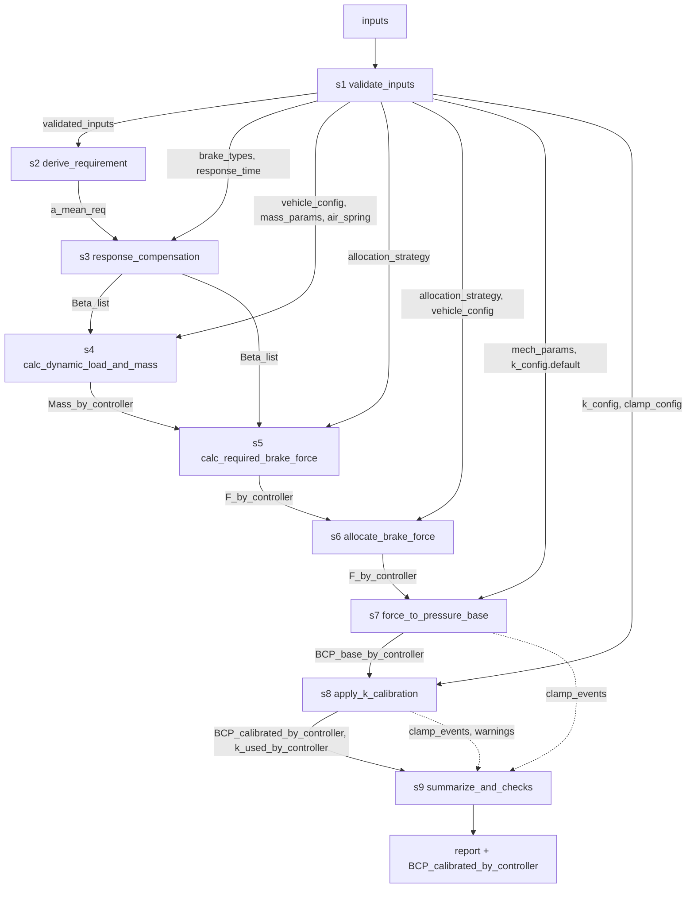

# 城轨制动计算 Workflow Spec（v1.0 草案）

<aside>
📌

这份文档是你这个“制动力计算 skill”的**确定性工作流 Spec**（面向 Codex 实现与 Hermes 调用）。

- 调试前：使用默认固定 k
- 调试后：按载荷组（AW0/AW3 必须，AW2 可选）启用 k(f) 校准曲线
</aside>

## 1. 输出位置与使用方式

- 本 spec 将作为项目的“唯一真相来源”（single source of truth）
- Codex：按本 spec 的模块接口与 workflow 顺序实现 Python 模块，并在本地进行项目调试。
- Hermes：后续部署到云端服务器，由Hermes按本 spec 的 inputs/配置加载并执行 workflow，输出压力标准与追溯信息。

## 2. 目标输出（Outputs）

### 2.1 主要输出

- `BCP_calibrated_by_controller`：每个控制器的目标控制压力/压力标准（带单位）
    - 输出按**实验条件载荷**（AW0 / AW2 / AW3）× **制动类型向量**（见 Inputs `brake_types`）组织，形成压力标准矩阵
    - 结构示意：`BCP_calibrated_by_controller[load_group][brake_type][controller] = pressure`

### 2.2 必须可追溯的中间量

- `Beta_list`：控制用目标减速度向量
    - 与 Inputs 中的 `brake_types` 一一对应，每个元素为该制动类型下的控制用目标减速度
    - 其中**最大常用制动（FSB）**与**紧急制动（EB）**的控制减速度由运动学方程（结合 `requirement` 与 `response_time.t1/t2`）计算得出
    - 其余用户自定义类型（如保持制动、跳跃制动）按其配置的 FSB 百分比直接缩放得到：`Beta[type] = ratio * Beta[FSB]`
- `Mass_by_controller`：按控制器聚合的静态质量 / 动态制动质量向量
    - 维度：`[load_group] × [controller]`，每个元素一般包含 `{ mass_static, mass_dynamic }`（含旋转质量的动态制动质量）
    - 动态质量的计算依赖控制器所在车辆的 `car_type`（动力车 / 非动力车），两者转动惯量不同
- `F_by_controller`：每控制器目标制动力 f（kN）
- `BCP_base_by_controller`：基础模型压力（未校准）
- `k_used_by_controller`：本次实际使用的 k（来源：default 或 calibrated 组）

## 3. 关键工程规则（必须满足）

1. **载荷 AW0/AW2/AW3 仅用于选择参数组**，运行时不做组间插值
2. **k 的自变量为目标制动力 f**（控制器粒度），即 `k = k_of_f(load_group, brake_mode, f)`
3. 校准不回写到 μ 或机械模型本体；只影响输出侧 `k(f)`/压力标准
4. 所有模式必须应用阀件限幅（如 EB 的 min/max）并在 report 中记录限幅触发

## 4. Inputs（输入参数，待你后续补齐单位/范围/默认值）

- `v0`：最高速度（技术条件定义点）
- `V_list`：可选（用于输出全速度向量结果）
- `requirement`：常用/紧急制动平均减速度或制动距离要求
- `brake_types`：制动类型向量，定义本次计算需要输出的所有制动类型
    - **必含项**：最大常用制动 `FSB`、紧急制动 `EB`（二者的控制减速度由运动学方程计算）
    - **可选项 — 快速制动 `FastBrake` / `FB`**（默认不启用）：如配置则加入制动类型与 `Beta_list`
        - 目标控制减速度等同 EB（直接复用 `Beta[EB]`，不单独走运动学）
        - 分配策略强制为 `equal_adhesion`，与 EB 一致，不受 `allocation_strategy` 影响
    - **可选项 — 用户自定义制动类型**，一般以「最大常用制动 FSB 的百分比」形式定义
        - 例：保持制动 `holding = 50% FSB`
        - 例：跳跃制动 `jerk = 10% FSB`
    - 建议结构：
        
        ```yaml
        brake_types:
          - name: FSB
            source: kinematic     # 由运动学计算
          - name: EB
            source: kinematic
          # 可选：启用快速制动（目标减速度等同 EB，强制等黏着）
          - name: FB
            source: copy_of_EB
          - name: holding
            source: ratio_of_FSB
            ratio: 0.5
          - name: jerk
            source: ratio_of_FSB
            ratio: 0.1
        ```
        
- `response_time`：响应时间，按制动模式（常用/紧急/快速等）分别给出，每个模式包含两个分量：
    - `t1` 空走时间（dead time）：从发出制动指令到开始产生减速度的时间，该段内认为减速度为 0
    - `t2` 建立时间（build-up time）：从开始产生减速度到减速度达到目标值 90% 的时间
    - 在 `response_compensation` 模块中，运动学方程会同时使用 `t1` 和 `t2` 来由平均减速度要求反推控制用目标减速度 `a_ctrl_target`
- `load_group`：AW0/AW2/AW3
- `air_spring`：空簧特性与 Pas↔载荷关系参数（如范例公式）
- `mass_params`：簧上/簧下/旋转质量参数
- `allocation_strategy`：制动力分配策略配置，可选一个：
    - `equal_wear`（等磨耗分配）：尽量在所有控制器上平均分配目标制动力
    - `equal_adhesion`（等黏着分配）：按各控制器控制范围内的载荷比例分配
    - **适用规则**：
        - 紧急制动（EB）与快速制动（FB，如启用）**必须**采用 `equal_adhesion`，不受本配置影响
        - 最大常用制动（FSB）及以 FSB 百分比定义的自定义类型（保持、跳跃等）按 `allocation_strategy` 配置执行
- `vehicle_config`：各控制器所在车辆的配置
    - 每个控制器指定其所在车辆的 `car_type`：`powered`（动力车） / `trailer`（非动力车）
    - `car_type` 影响该控制器作用域内的旋转质量（转动惯量），进而影响动态制动质量的计算
    - 建议结构：
        
        ```yaml
        controllers:
          - name: C1
            car_type: powered
          - name: C2
            car_type: trailer
        ```
        
- `mech_params`：制动缸参数（Nbc、η、Sp、L_bc、Fs1/Fs2、ξ 等）
- `k_config`：k 的默认值与标定曲线配置（见第 6 节）
- `clamp_config`：阀件限幅配置（如 min/max）

## 5. 模块间数据契约（Context 模型）

> 本节只定义**数据契约**（字段/形状/单位/生产者-消费者），不规定传输实现（dict / pydantic / JSON / RPC 均可）。具体实现方式放到代码仓库的 `AGENTS.md`。
> 

### 5.1 Context 原则

- 所有模块采用 `context_in → context_out` 语义，**追加式写入**（append-only），不得修改或覆盖上游已写字段
- 每个字段 key 在全局范围内唯一；一旦产出，下游只读引用
- 未消费的上游字段应**透传**到下游，以保证端到端可追溯
- 所有数值字段必须带**单位**（见下表），工程量纲不一致时需在 `validate_inputs` 中统一化

### 5.2 Context 字段清单

| key | shape | dtype / unit | producer | consumers |
| --- | --- | --- | --- | --- |
| `validated_inputs` | 嵌套对象 | — | s1 | s2–s9 |
| `a_mean_req` | `[brake_type]`（仅 kinematic 类型） | m/s² | s2 | s3 |
| `Beta_list` | `[brake_type]` | m/s² | s3 | s4, s5 |
| `Mass_by_controller` | `[load_group, controller]` → `{mass_static, mass_dynamic}` | kg | s4 | s5, s6 |
| `F_by_controller` | `[brake_type, load_group, controller]` | kN | s5 (+ s6 规范化) | s7, s8 |
| `BCP_base_by_controller` | `[brake_type, load_group, controller]` | kPa | s7 | s8 |
| `k_used_by_controller` | `[brake_type, load_group, controller]` | 无量纲 | s8 | s9 |
| `BCP_calibrated_by_controller` | `[load_group, brake_type, controller]` | kPa | s8 | s9（最终输出） |
| `clamp_events` | `List[{brake_type, load_group, controller, kind, value_before, value_after}]` | — | s7, s8 | s9 |
| `warnings` | `List[{code, message, context}]` | — | 任意模块 | s9 |
| `trace` | `List[{step_id, module, inputs_hash, outputs_keys, elapsed_ms}]` | — | runner | s9 |

### 5.3 关键张量形状（约定）

```yaml
F_by_controller:
  shape: [brake_type, load_group, controller]
  dtype: float
  unit: kN
BCP_base_by_controller:
  shape: [brake_type, load_group, controller]
  dtype: float
  unit: kPa
BCP_calibrated_by_controller:
  shape: [load_group, brake_type, controller]   # 最终输出按 load_group 为主索引
  dtype: float
  unit: kPa
```

### 5.4 错误 / 告警 / 追溯通道

- `warnings`：非致命情形写入，如 k 超标定范围、AW2 使用 fallback、限幅触发等；每条含稳定的 `code` 便于机器判定
- `clamp_events`：阀件限幅的事件流，记录限幅前/后值，供 `summarize_and_checks` 统计
- `trace`：由 runner（本地调试或 Hermes）写入，每个 step 的输入 hash / 输出 key / 耗时，用于复跑比对
- **致命错误**（例如输入校验失败）应直接抛异常中止 workflow，不走 `warnings`

### 5.5 数据流图



## 6. Modules（模块接口定义）

> 每个模块都遵循：输入 `context` → 输出 `context`（添加字段，不破坏既有字段）
> 

1) `validate_inputs`

- in: inputs
- out: validated_inputs
- 作用：对输入参数做结构/类型/单位校验与归一化，填默认值，产出后续模块可信赖的 `validated_inputs`

2) `derive_requirement`

- in: validated_inputs
- out: a_mean_req
- 作用：将技术条件 `requirement`（平均减速度 **或** 制动距离）统一换算成 `a_mean_req` — 即各「运动学类」制动类型（FSB、EB）对应的**平均减速度需求值**；若输入为制动距离，在此处由 v0 和距离反算出等效平均减速度

3) `response_compensation`

- in: validated_inputs（含 `brake_types`、`response_time.t1`、`response_time.t2`） + a_mean_req
- out: `Beta_list`（与 `brake_types` 顺序对应的控制用目标减速度向量）
- note:
    - 对 `source: kinematic` 的制动类型（FSB、EB），运动学方程需同时考虑空走时间 t1（无减速度段）与建立时间 t2（减速度从 0 线性/近似上升至目标 90% 段），由平均减速度要求反推稳态目标减速度
    - 对 `source: copy_of_EB` 的快速制动（FB，如启用），直接复用 `Beta[EB]`，不单独求解运动学
    - 对 `source: ratio_of_FSB` 的用户自定义类型，直接按 `ratio * Beta[FSB]` 得到，不再单独做运动学补偿

4) `calc_dynamic_load_and_mass`

- in: validated_inputs（含 `vehicle_config.car_type`、`mass_params`、`air_spring`） + `Beta_list`
- out: `Mass_by_controller`（按 `load_group × controller` 的质量向量，包含静态质量与含旋转质量的动态制动质量）
- note: 动力车 vs. 非动力车的旋转质量（转动惯量折算）不同，需按控制器的 `car_type` 分别计算

5) `calc_required_brake_force`

- in: `Beta_list` + `Mass_by_controller`
- out: F_by_controller（kN），按 `brake_type × load_group × controller` 组织
- note: 各控制器目标制动力的计算需结合 `allocation_strategy` 与适用规则：
    - EB 与 FB（如启用）强制采用 `equal_adhesion`（按 `Mass_by_controller` 的静态/动态载荷比例分配整车总制动力）
    - FSB 及 `ratio_of_FSB` 类型：若 `allocation_strategy = equal_wear`，则各控制器平均分配；若为 `equal_adhesion`，则按载荷比例分配

6) `allocate_brake_force`

- in: F_by_controller + allocation_strategy + vehicle_config
- out: F_by_controller（确认粒度与分配后的结构；如步骤 5 已按策略给出最终值，此步仅做验证与粒度规范化）
- 作用：校验「按策略分配后的控制器制动力」是否满足设计约束（如各控制器黏着上限、各车辆比例），并统一输出粒度；若检测到约束越限写入 `warnings`

7) `force_to_pressure_base`

- in: F_by_controller + mech_params + (k_default) + a_offset
- out: BCP_base_by_controller

8) `apply_k_calibration`（模块 8.5）

- in: load_group + brake_mode + F_by_controller + k_config + BCP_base_by_controller
- out: k_used_by_controller + BCP_calibrated_by_controller
- note: 如需观察校准幅度，可在 `summarize_and_checks` 的 report 中临时计算 `BCP_calibrated - BCP_base`，不作为持久化字段。最终 `BCP_calibrated_by_controller` 以 `[load_group ∈ {AW0, AW2, AW3}] × [brake_type ∈ brake_types] × [controller]` 的三维结构输出，用于实验条件下的压力标准比对

9) `summarize_and_checks`

- in: all
- out: report
- 作用：汇总中间量、限幅事件、告警和追溯信息，生成人/机可读的 `report`（包含压力标准矩阵、`delta_BCP` 临时统计、k 来源、clamp 触发统计等），供本地调试与 Hermes 返回

## 7. k_config（默认 + 标定曲线 + fallback）

### 7.1 调试前默认值（必须）

- `default.FSB.k_const`
- `default.EB.k_const`

### 7.2 调试后标定（可选启用）

- 必须提供：AW0、AW3
- 可选提供：AW2

### 7.3 AW2 fallback（当 AW2 缺失时）

- 默认建议：`fallback.AW2 = AW3`

### 7.4 k(f) 表达形式（推荐 piecewise）

- 支持：分段常数 + 中段线性（与你 Mathcad 范例一致）

## 8. Workflow（确定执行顺序）

> 每个 step 用一句 `desc` 说明作用，详细语义见第 6 节同名模块
> 

```yaml
workflow:
  - id: s1
    use: validate_inputs
    desc: 校验输入结构与单位，填默认值，产出可信赖的 validated_inputs
  - id: s2
    use: derive_requirement
    needs: [s1]
    desc: 统一换算 requirement（平均减速度或制动距离）为 a_mean_req（运动学类型的平均减速度需求）
  - id: s3
    use: response_compensation
    needs: [s2]
    desc: 根据 t1/t2 反推稳态目标减速度，产出 Beta_list（含 FSB/EB 运动学解、FB 复用 EB、比例类型缩放）
  - id: s4
    use: calc_dynamic_load_and_mass
    needs: [s3]
    desc: 按 AW0/AW2/AW3 和控制器 car_type 计算 Mass_by_controller（静态+含旋转质量的动态制动质量）
  - id: s5
    use: calc_required_brake_force
    needs: [s4]
    desc: 结合 Beta_list、Mass_by_controller 与分配策略（EB/FB 等黏着、FSB/比例类型按配置）得出 F_by_controller
  - id: s6
    use: allocate_brake_force
    needs: [s5]
    desc: 验证分配结果是否满足约束，统一结构粒度；越限则写入 warnings
  - id: s7
    use: force_to_pressure_base
    needs: [s6]
    desc: 用机械模型（mech_params + 默认 k）将 F_by_controller 换算为未校准的 BCP_base_by_controller
  - id: s8
    use: apply_k_calibration
    needs: [s7]
    desc: 按 load_group + brake_mode 选取 k(f) 标定曲线，对 BCP_base 做校准与限幅，得到最终 BCP_calibrated_by_controller
  - id: s9
    use: summarize_and_checks
    needs: [s8]
    desc: 汇总输出、告警、clamp 事件与 trace，生成 report
```

## 9. 与 Mathcad 范例对齐（待补）

- 把 example_brake_calc.pdf 中的字段表、公式、结果表逐条映射到上述 modules 的输入/输出